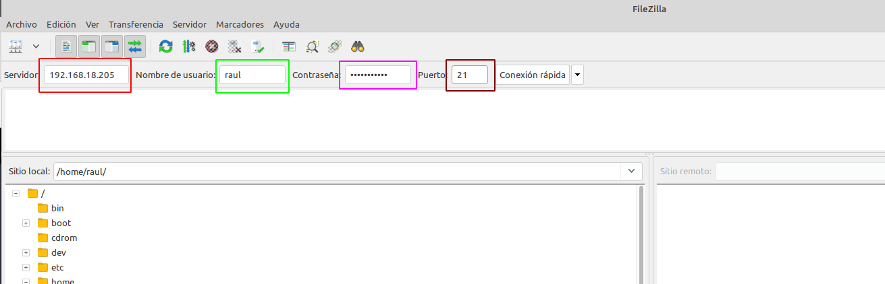
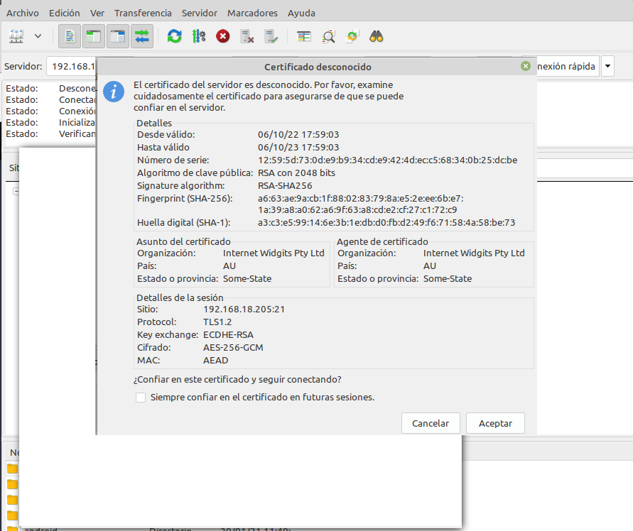

### ¿Cómo transferir archivos desde nuestra máquina local/anfitrión a nuestra máquina virtual Debian/servidor remoto? FTP

A día de hoy el proceso más sencillo y seguro es a través de Github como hemos visto antes. No obstante, el currículum de la Consellería d'Educació me obliga a enseñaros un método un tanto obsoleto a día de hoy, así que vamos a ello, os presento al FTP.

[El FTP](https://es.wikipedia.org/wiki/Protocolo_de_transferencia_de_archivos) es un protocolo de transferencia de archivos entre sistemas conectados a una red TCP. Como su nombre indica, se trata de un protocolo que permite transferir archivos directamente de un dispositivo a otro. Actualmente, es un protocolo que poco a poco va abandonándose, pero ha estado vigente más de 50 años.

El protocolo FTP tal cual es un protocolo inseguro, ya que su información no viaja cifrada. Sin embargo, en 2001 esto se solucionó con el protocolo **SFTP**, que le añade una capa SSH para hacerlo más seguro y privado.

**SFTP** no es más que el mismo protocolo FTP pero implementado por un canal seguro. Son las siglas de SSH File Transfer Protocol y consiste en una extensión de Secure Shell Protocol (SSH) creada para poder hacer transmisiones de archivos.

La seguridad que nos aporta **SFTP** es importante para la transferencia de archivos porque, si no disponemos de ella, los archivos viajarán tal cual por la red, sin ningún tipo de encriptación. Así pues, usando FTP tradicional, si algún agente consigue escuchar las transferencias, podría ocurrir que la información quedase al descubierto. Esto sería especialmente importante si los archivos que subimos contienen información confidencial o datos personales.

Dado que usar **SFTP** aporta mayor seguridad a las transmisiones, es recomendable utilizarlo, más aún sabiendo que realmente no hay mucha dificultad en establecer las conexiones por el protocolo seguro.

### Configurar servidor SFTP en Debian

En primer lugar, lo instalaremos desde los repositorios:

```sh
sudo apt-get update
sudo apt-get install vsftpd
```
Ahora vamos a crear una carpeta en nuestro *home* en Debian:

```sh
mkdir /home/nombre_usuario/ftp
```

En la configuración de *vsftpd* indicaremos que este será el directorio al cual vsftpd se cambia después de conectarse el usuario.

Ahora vamos a crear los certificados de seguridad necesarios para aportar la capa de cifrado a nuestra conexión (algo parecido a HTTPS)

```sh
sudo openssl req -x509 -nodes -days 365 -newkey rsa:2048 -keyout /etc/ssl/private/vsftpd.pem -out /etc/ssl/private/vsftpd.pem
```

Y una vez realizados estos pasos, procedemos a realizar la configuración de *vsftpd* propiamente dicha. Se trata, con el editor de texto que más os guste, de editar el archivo de configuración de este servicio, por ejemplo con *nano*:

```sh
sudo nano /etc/vsftpd.conf
```

En primer lugar, buscaremos las siguientes líneas del archivo y las eliminaremos por completo:

```linuxconfig
rsa_cert_file=/etc/ssl/certs/ssl-cert-snakeoil.pem
rsa_private_key_file=/etc/ssl/private/ssl-cert-snakeoil.key
ssl_enable=NO
```

Tras ello, añadiremos estas líneas en su lugar

```linuxconfig 
rsa_cert_file=/etc/ssl/private/vsftpd.pem
rsa_private_key_file=/etc/ssl/private/vsftpd.pem
ssl_enable=YES
allow_anon_ssl=NO
force_local_data_ssl=YES
force_local_logins_ssl=YES
ssl_tlsv1=YES
ssl_sslv2=NO
ssl_sslv3=NO
require_ssl_reuse=NO
ssl_ciphers=HIGH

local_root=/home/nombre_usuario/ftp
```

Y, tras guardar los cambios, reiniciamos el servicio para que coja la nueva configuración:

```sh
sudo systemctl restart --now vsftpd
```

!!!task "Tarea"
    Configura un nuevo dominio (nombre web) para el .zip con el nuevo sitio web que os proporcionado. **En este caso debéis transferir los archivos a vuestra Debian mediante SFTP.**


Tras acabar esta configuración, ya podremos acceder a nuestro servidor mediante un cliente FTP adecuado, como por ejemplo [Filezilla](https://filezilla-project.org/) de dos formas, a saber:

+ Mediante el puerto por defecto del protocolo <u>inseguro</u> FTP, el 21, pero utilizando certificados que cifran el intercambio de datos convirtiéndolo así en <u>seguro</u>
  
+ Haciendo uso del protocolo *SFTP*, dedicado al intercambio de datos mediante una conexión similar a SSH, utilizando de hecho el puerto 22.

Tras descargar <U>**el cliente FTP**</u> en nuestro ordenador, introducimos los datos necesarios para conectarnos a nuestro servidor FTP en Debian:



+ La IP de Debian (recuadro rojo)
+ El nombre de usuario de Debian (recuadro verde)
+ La contraseña de ese usuario (recuadro fucsia)
+ El puerto de conexión, que será el 21 para conectarnos utilizando los certificados generados previamente (recuadro marrón)

Tras darle al botón de *Conexión rápida*, nos saltará un aviso a propósito del certificado, le damos a aceptar puesto que no entraña peligro ya que lo hemos genrado nosotros mismos:



Nos conectaremos directamente a la carpeta que le habíamos indicado en el archivo de configuración `/home/raul/ftp`

Una vez conectados, buscamos la carpeta de nuestro ordenador donde hemos descargado el *.zip* (en la parte izquierda de la pantalla) y en la parte derecha de la pantalla, buscamos la carpeta donde queremos subirla. Con un doble click o utilizando *botón derecho > subir*, la subimos al servidor.


Si lo que quisiéramos es conectarnos por **SFTP**, exactamente igual de válido, haríamos:


Fijáos que al utilizar las claves de SSH que ya estamos utilizando desde la Práctica 1, no se debe introducir la contraseña, únicamente el nombre de usuario.

Puesto que nos estamos conectando usando las claves FTP, nos sale el mismo aviso que nos salía al conectarnos por primera vez por SSH a nuestra Debian, que aceptamos porque sabemos que no entraña ningún peligro en este caso:


Y vemos que al ser una especie de conexión SSH, nos conecta al `home` del usuario, en lugar de a la carpeta `ftp`. A partir de aquí ya procederíamos igual que en el otro caso.

Recordemos que debemos tener nuestro sitio web en la carpeta `/var/www` y darle los permisos adecuados, de forma similiar a cómo hemos hecho con el otro sitio web. 

El comando que nos permite descomprimir un *.zip* en un directorio concreto es:

```sh
unzip archivo.zip -d /nombre/directorio
```

Si no tuvieráis unzip instalado, lo instaláis:

```sh
sudo apt-get update && sudo apt-get install unzip
```

