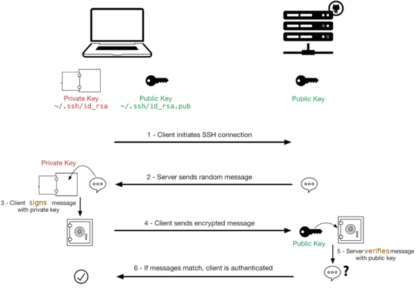

## ¿Qué es AWS Academy?

**AWS Academy** es una iniciativa de **Amazon Web Services** que proporciona a las instituciones educativas contenido y recursos de formación en la nube. Su objetivo es preparar a estudiantes y educadores con habilidades prácticas en tecnologías "cloud", facilitando el acceso a materiales de estudio, laboratorios prácticos y certificaciones oficiales de AWS.

Nosotros lo usaremos para crear nuestros servidores en la nube y desplegar sobre ellos nuestros servicios. Esto nos aportará diversas ventajas, entre ellas:

* No dependemos del equipo que tenga cada alumno: da igual su potencia, sistema operativo o versión
* Todos trabajaremos con una máquina virtual exactamente igual, evitando los problemas de que a unos les funcione y a otros no
* Podemos trabajar en el aula y seguir trabajando desde casa sobre la misma máquina virtual
* No necesitamos discos duros de gran capacidad para alojar nuestras máquinas virtuales.
* El despliegue de una máquina virtual es casi instantáneo

## ¿Cómo crearemos nuestras máquinas virtuales en AWS Academy?

En las 2 prácticas de este módulo introductorio aprenderemos a crear **servidores virtuales en AWS**, conocidos como **EC2**. Aunque la creación es siempre igual, independientemente del sistema operativo que instalemos, el acceso posterior será diferente en función de que nos conectemos en modo comando o en modo gráfico. Así pues, crearemos una máquina linux a la que accederemos en modo comando por SSH y un servidor Windows al que accederemos en modo gráfico con RDP.

Veamos a continuación las bases teóricas de la conexión SSH que nos permitirán entender la conexión que estableceremos posteriormente en las prácticas. No entraremos en detalle en el protocolo RDP.

## ¿Cómo nos conectaremos por SSH a nuestras máquinas virtuales en AWS Academy? 

Para conectarnos a una máquina de forma remota y segura en modo comando, la opción más recomendable es SSH.

**SSH o Secure Shell** es un protocolo de red criptográfico para operar servicios de red de forma segura a través de una red no protegida. Las aplicaciones típicas incluyen línea de comandos remota, inicio de sesión y ejecución de comandos remota, pero cualquier servicio de red puede protegerse con SSH.

SSH proporciona un canal seguro a través de una red no segura mediante el uso de una arquitectura cliente-servidor, conectando una aplicación cliente SSH con un servidor SSH.  El **puerto TCP estándar para SSH es 22** y se usa generalmente para acceder a sistemas operativos similares a Unix, pero también se puede usar en Microsoft Windows.

Proporciona un mecanismo para autenticar un usuario remoto, transferir entradas desde el cliente al servidor y retransmitir la salida de vuelta al cliente.

SSH tiene muchas aplicaciones diferentes:

+ Gestión de servidores a los que no se puede acceder localmente
+ Transferencia segura de archivos
+ Creación de copias de seguridad
+ Conexión entre dos ordenadores con encriptación de extremo a extremo
+ Mantenimiento remoto desde otros ordenadores

### Autenticación

Los dos métodos de autenticación de usuario SSH más comunes que se utilizan so:

* las contraseñas (cifrado simétrico)
* las claves SSH (cifrado asimétrico o de clave pública). 
  
Los clientes envían contraseñas cifradas al servidor de forma segura. Sin embargo, las contraseñas son un método de autenticación arriesgado porque su solidez depende de que el usuario sepa qué hace que una contraseña sea segura. 

Los pares de claves pública-privada SSH encriptados asimétricamente son una mejor opción. Una vez que el cliente descifra el mensaje, el servidor le otorga acceso al sistema.

!!! note
    SSH opta por el **cifrado híbrido**, donde se utiliza el cifrado **asimétrico para establecer la comunicación** e intercambiar unas claves **simétricas** que serán las que se utilizarán **posteriormente en el intercambio de información**.

#### Cifrados simétricos o de clave privada

Este tipo de cifrado utiliza la misma clave para cifrar y para descifrar la información. Por este motivo, la clave debe ser secreta y solo conocida por el emisor y el receptor del mensaje. Se usa la misma clave para cifrar y descrifrar el mensaje.

**Ventajas**

+ Muy rápidos → cifrar y descifrar un mensaje cada vez requiere un cierto tiempo, que si el algoritmo es complejo, puede ser elevado. 

**Inconvenientes**

+ Si alguien no autorizado consigue la clave, podrá espiar la comunicación sin problemas
+ ¿Cómo hacemos para que emisor y receptar conozcan la clave en un primer momento?
    + no se puede transmitir por el canal inseguro
    + hay que transmitirla por otro canal seguro
    + **Ejemplos:** PIN de la tarjeta del banco o archivo comprimido con contraseña

##### Cifrados asimétricos o de clave pública

En este tipo de cifrados cada usuario utiliza un par de claves: una clave pública y una clave privada. Un mensaje cifrado con la clave pública solo se puede descifrar con su correspondiente clave privada y viceversa.

La *clave pública* es accesible a cualquier persona que quiera consultarla, no hace falta que sea transmitida por un canal seguro como en el caso anterior.

La *clave privada* solo la debe conocer su dueño.

###### Encriptación de un mensaje con clave pública/privada

Veamos cómo podemos usar un par de claves pública/privada para cifrar un mensaje por parte del emisor que solo pueda descrifrar el receptor.

 1. El emisor cifra un mensaje con la clave pública del receptor
 2. El receptor recibe el mensaje y es el único que podrá descifrarlo porque es el único que posee la clave cifrada asociada

**Ventajas**

  + No se necesita un nuevo canal independiente y seguro para transmitir la clave pública del receptor, que puede ser conocida por cualquiera.

**Inconvenientes**

  + Son más lentos que los cifrados simétricos
  + Hay que proteger muy bien la clave privada y tenerla siempre disponible para poder descifrar los mensajes (no es una contraseña)
  + Hay que asegurarse de que la clave pública es de quién dice ser y no de un impostor que se esté haciendo pasar por él

###### Acceso a un servidor con clave pública/privada

El proceso de autenticación usando pares de claves pública y privada, como en SSH, sigue estos pasos:

1. **Generación de claves**: El usuario genera un par de claves, una clave privada y una clave pública. La clave privada se mantiene en su máquina, y la clave pública se copia al servidor al que desea acceder, generalmente en el archivo ~/.ssh/authorized_keys del servidor.

2. **Inicio de sesión**: Cuando el usuario intenta conectarse al servidor, el servidor utiliza la clave pública que tiene almacenada para generar un desafío (mensaje aleatorio). Envía este desafío al usuario para que lo firme.

3. **Respuesta del cliente**: El usuario, con su clave privada (que nunca se comparte), cifra el desafío recibido y lo envía de vuelta al servidor como prueba de que posee la clave privada correspondiente a la clave pública.

4. **Validación del servidor**: El servidor descifra la respuesta del cliente con la clave pública que tiene. Si la respuesta es correcta, el servidor sabe que el usuario tiene la clave privada y, por lo tanto, lo autentica, permitiendo el acceso. 

Este proceso garantiza que la autenticación es segura, ya que la clave privada nunca sale de la máquina del usuario y no es necesaria una contraseña si la clave está correctamente configurada.

### ¿Cómo usa AWS el cifrado asimétrico?
    
En AWS deberemos crear un conjunto de claves pública-privada para acceder a nuestros servidores virtuales. Podemos crear tantas claves pública/privada cómo queramos, pero en nuestro módulo bastará con crear una y usar la misma para acceder a todos los servidores.

Crearemos el par de claves en el propio entorno AWS. Descargaremos en nuestro ordenador la clave privada, que solo poseeremos nosotros. En cada servidor que creemos le asociaremos la clave pública de la pareja, que se mantiene en AWS. De esta manera, para poder realizar la conexión necesitaremos la clave privada que solo nosotros poseeremos en nuestro equipo local.

Es importante mantener la clave privada a buen recaudo y tenerla disponible tanto en el aula como en casa para poder conectarnos a nuestras máquinas virtuales en AWS.
