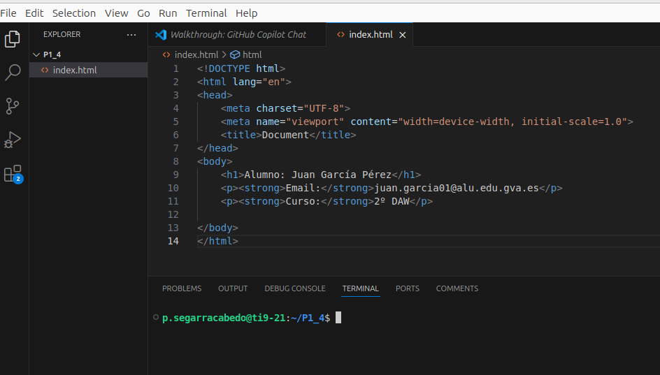

# Práctica 1.4 – Ciclo de despliegue: de local a publicado en web

## Objetivo
En esta práctica vas a realizar el ciclo completo de despliegue web, desde tu equipo local hasta la publicación en un servidor accesible por Internet. El documento detalla cada paso, con comandos listos para copiar y notas para evitar errores habituales.

---

## 1. Preparar el entorno local

En tu ordenador local (Casa o Instituto), abre un terminal y ejecuta:

```bash
mkdir P1_4
cd P1_4
code .
```

Esto abrirá Visual Studio Code en la carpeta `P1_4`.

---

## 2. Crear `index.html`

Crea un archivo llamado `index.html` con el siguiente contenido de ejemplo (puedes adaptarlo con tus datos reales):

```html
<!DOCTYPE html>
<html lang="es">
<head>
  <meta charset="UTF-8">
  <meta name="viewport" content="width=device-width, initial-scale=1.0">
  <title>Práctica 1.4 - Despliegue Web</title>
</head>
<body>
  <h1>Alumno: Juan García Pérez</h1>
  <p><strong>Email:</strong> juan.garcia01@alu.edu.gva.es</p>
  <p><strong>Curso:</strong> 2º DAW</p>
</body>
</html>
```

---

## 3. Subir el proyecto a GitHub

Desde el terminal integrado de Visual Studio Code, sube tu proyecto al repositorio de GitHub de la práctica (`P1_4`). Asegúrate de tener Git instalado y la autenticación por SSH configurada previamente.


### Pasos

1) Inicializa el repositorio y crea el primer commit:

```bash
git init
git add .
git commit -m "Subida inicial práctica P1_4"
```

2) Define la rama principal y vincula el remoto:

```bash
# Opción A (recomendada en GitHub actual)
git branch -M main

# Opción B (si tu entorno usa master)
# git branch -M master
```

3) Añade el remoto y sube la rama principal (sustituye tu_usuario por tu usuario real de GitHub):

```bash
git remote add origin git@github.com:tu_usuario/P1_4.git

# Si usas main
git push -u origin main

# Si usas master
# git push -u origin master
```

4) Etiqueta la entrega para identificar la versión:

```bash
git tag -a P1_4 -m "Entrega práctica 1.4"
git push origin P1_4
```

**Nota:** Mantén coherencia entre `main` o `master` en todos los comandos (push/pull/merge).

---

## 4. Conexión al servidor remoto (AWS)

En el aula solo se permiten conexiones SSH a dominios autorizados (p. ej., GitHub o AWS). Por ello, usarás una instancia en AWS para continuar el despliegue.

1) Ten creada tu instancia (p. ej., Debian) y descarga la clave privada `.pem` al crearla.  
2) Asigna permisos adecuados a la clave:

```bash
chmod 400 mi_clave.pem
```

3) Conéctate a tu instancia desde el ordenador local

```bash
ssh -i "ruta/mi_clave.pem" debian@<IP_PUBLICA_AWS>
```

Ejemplo:

```bash
ssh -i "~/.ssh/mi_clave.pem" debian@ip_AWS
```

---

## 5. Generar claves SSH para el servidor del profesor (`iespublico.com`)

Desde tu servidor AWS, genera un par de claves para acceder al servidor del profesor. **No compartas nunca la clave privada.**

```bash
ssh-keygen -t ed25519 -C "tu_correo@alu.edu.gva.es" -f ~/.ssh/iespublico
```

Entrega la clave pública en Aules para que el profesor la añada al servidor:

```bash
cat ~/.ssh/iespublico.pub
```

---

## 6. Conexión al servidor `iespublico.com` y despliegue

1) Conéctate al servidor del dominio `iespublico.com` usando tu **subdominio** como usuario:

```bash
ssh -i ~/.ssh/iespublico subdominio@subdominio.iespublico.com
```

2) Dentro del servidor, genera un par de claves para conectar con GitHub y añade la **clave pública** en tu cuenta de GitHub (Settings → SSH and GPG keys → New SSH key):

```bash
ssh-keygen -t ed25519 -C "tu_correo@alu.edu.gva.es" -f ~/.ssh/github
cat ~/.ssh/github.pub
```

3) Ve al directorio público de tu sitio y descarga el repositorio:

```bash
cd /var/www/subdominio/public_html

# Si ya existe el repo remoto configurado en esta carpeta
git pull origin main      # o: git pull origin master

# Si es la primera vez
git clone git@github.com:tu_usuario/P1_4.git .
```
> [!NOTE]
> Para la conexión correcta se debe poner:  
> `ssh -i ~/.ssh/id_ed25519 git@github.com`  
>
> Ya que la clave que hemos creado no es predeterminada, debemos usar la opción **-i** para indicar cuál utilizar.  
>
> Puedes hacer una mejora configurando una vez el archivo `~/.ssh/config`:
>
> ```bash
> Host github.com
>   HostName github.com
>   User git
>   IdentityFile ~/.ssh/id_ed25519
> ```
>
> A partir de ahí, ya podrás conectarte directamente con:  
> `ssh git@github.com`


4) Comprueba que `index.html` está en `public_html` y verifica la publicación accediendo a:

```
http://subdominio.iespublico.com
```

---
Verás que el navegador quiere ir por defecto a https, debes quitar la s de SSL. Aprenderemos más adelante a generar la web con SSL.

## Resultado esperado
Tu `index.html` debe estar accesible en tu subdominio dentro de `iespublico.com`, mostrando correctamente la información indicada.

## Próximos pasos
Este es un ejercicio base para comprender el flujo de despliegue. En prácticas posteriores se realizará el proceso con Docker, y stacks como LAMP y LEMP, entre otros.
