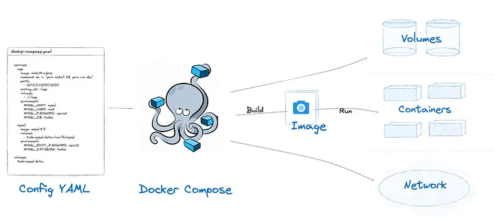

# Docker Compose

!!! warning "Actualización importante (noviembre 2025)"
    Docker ha cambiado la forma de ejecutar **Compose**:  
    el comando ya **no usa guion**.

    **Antes:**
    ```bash
    docker-compose up -d
    ```

    **Ahora:**
    ```bash
    docker compose up -d
    ```

    > El formato antiguo (`docker-compose`) está **en desuso** y se eliminará en futuras versiones.


En el capítulo anterior hemos levantado un Wordpress usado el cliente de _Docker_ para crear los contenedores, así como para crear el resto de objetos y vincularlos entre sí. Si recuerdas los comandos son complejos y extensos. Además hemos de ejecutar primero la creación del contenedor con la base de datos y luego el contenedor con Wordpress. Vemos que sería mucho más cómodo poder configurarlo todo en un solo archivo y lanzar todos los contenedores, convenientemente enlazados, con un solo comando. 

Para automatizar la creación, inicio y parada de un contenedor o un conjunto de ellos, _Docker_ proporciona una herramienta llamada _Docker Compose_.

Para esta parte vamos a levantar el mismo Wordpress del capítulo anterior pero usando esta herramienta. Empezaremos por detener y borrar lo que hemos creado:

```console
    docker container stop wordpress wordpress-db
    docker container rm wordpress wordpress-db
    docker volume rm vol-wordpress-db
    sudo rm -R -f ~/Sites/wordpress/target/*
```
## Docker Compose

_Compose_ es una herramienta para definir y ejecutar aplicaciones multi-contenedor. Con un solo comando podremos crear e iniciar todos los servicios que necesitamos para nuestra aplicación.

Los casos de uso más habituales para docker-compose son:

* Entornos de desarrollo
* Entornos de testeo automáticos (integración contínua)
* Despliegue en host individuales (no clusters)

_Compose_ tiene comandos para manejar todo el ciclo de vida de nuestra aplicación:

* Iniciar, detener y rehacer servicios.
* Ver el estado de los servicios.
* Visualizar los logs.
* Ejecutar un comando en un servicio.

## Creación de contenedores automatizada

En el mismo directorio donde estábamos en el paso anterior (`~/Sites/wordpress`), vamos a crear un fichero llamado `docker-compose.yaml` con el siguiente contenido:

```yaml
version: '3'

services:
    db:
        image: mariadb:10.3.9
        volumes:
            - data:/var/lib/mysql
        environment:
            - MYSQL_ROOT_PASSWORD=secret
            - MYSQL_DATABASE=wordpress
            - MYSQL_USER=manager
            - MYSQL_PASSWORD=secret
    web:
        image: wordpress:4.9.8
        depends_on:
            - db
        volumes:
            - ./target:/var/www/html
        environment:
            - WORDPRESS_DB_USER=manager
            - WORDPRESS_DB_PASSWORD=secret
            - WORDPRESS_DB_HOST=db
        ports:
            - 8080:80

volumes:
    data:
```    

!!! info
    YAML es un lenguaje de serialización de datos diseñado para ser leído y escrito por personas. Se recomienda que sigas algún tutorial para entender su formato: [Aprende YAML en Y minutos](https://learnxinyminutes.com/docs/es-es/yaml-es/).

Los ficheros de _Compose_ están divididos en tres secciones: _services_, _volumes_ y _networks_; y deben indicar un número de versión de _Docket compose_ que estamos usando. Nos permite realizar practicamente lo mismo que podemos hacer con el cliente de _docker_, pero de forma automática.


    Fuente: [https://medium.com/@laurap_85411/docker-compose-stop-vs-down-e4e8d6515a85](https://medium.com/@laurap_85411/docker-compose-stop-vs-down-e4e8d6515a85)

!!! note
    En este taller no entramos en el apartado de _networks_.

Con este fichero podemos hacer lo mismo que hemos hecho en el capítulo anterior, pero con la ventaja de describir todos nuestros requisitos en un solo archivo.

## Iniciar servicios

Vamos a ejecutar esta aplicación y luego procederemos a explicarla:

!!! example
    Arranca la aplicación con _Compose_:

        docker-compose up -d

Cuando arrancamos la aplicación, _Compose_ nos informa de los servicios que ha ido levantando:

```console
$ docker-compose up -d
Creating network "wordpress_default" with the default driver
Creating volume "wordpress_data" with local driver
Creating wordpress_db_1 ... 
Creating wordpress_db_1 ... done
Creating wordpress_web_1 ... 
Creating wordpress_web_1 ... done
```

El parámetro `-d` es similar al que hemos visto en `docker run`: nos permite levantar los servicios en segundo plano.

Veamos los contenedores activos:

```console
$ docker ps
CONTAINER ID  IMAGE            COMMAND      CREATED         STATUS         PORTS                  NAMES
a07b5d4d3982  wordpress:4.9.8  "docker.s…"  10 seconds ago  Up 8 seconds   0.0.0.0:8080->80/tcp   wordpress_web_1
d9204884cec5  mariadb:10.3.9   "docker.s…"  11 seconds ago  Up 10 seconds  3306/tcp               wordpress_db_1
```
También podemos ver los contenedores con _Compose_:

```console
$ docker-compose ps
    Name                    Command               State          Ports        
-------------------------------------------------------------------------------
wordpress_db_1    docker-entrypoint.sh mysqld      Up      3306/tcp            
wordpress_web_1   docker-entrypoint.sh apach ...   Up      0.0.0.0:8080->80/tcp
```
Lo que tenemos que tener en cuenta es lo siguiente:

* `docker-compose ps` solo muestra información de los servicios que se define en `docker-compose.yaml`, mientras que `docker ps` muestra todos.
* Cuando creamos contenedores con `docker` sin indicar un nombre, por defecto asigna uno aleatorio; mientras que en _Compose_ el prefijo es el nombre del directorio en que se encuentra el fichero .yaml y el sufijo el nombre del servicio: _**wordpress**\_**db**\_1_. El número final indica el número de instancia. Es posible levantar más de una instancia de un mismo servicio.

Si accedemos a la dirección [http://localhost:8080/](http://localhost:8080/), veremos de nuevo la instalación de WordPress.

!!! warning
    Recuerda que si estás trabajando en AWS Academy y accedes a la EC2 desde tu PC host, deberás sustituir *localhost* por la IP pública de tu EC2.

    Fíjate bien que accedemos a wordpress con http y no https. Los navegadores modernos intentarán usar https si no les dices lo contrario. 
    
    Recuerda que deberás crear una regla de entrada en el "grupo de seguridad" que usa tu EC2 de AWS para permitir el acceso a la máquina por http.

## Detener servicios

Podemos detener servicios con

    docker-compose stop

## Borrar servicios

Podemos borrar servicios con

    docker-compose down

Esto borra los contenedores, pero no los volúmenes. Así que si hemos creado bien la aplicación nuestros datos están a salvo.

Si queremos borrar también los volúmenes:

    docker-compose down -v

## Estructura de la configuración

Veamos la configuración por partes:

```yaml hl_lines="1"
version: '3'
```

_Compose_ se actualiza a menudo, con lo que el archivo de configuración va adquiriendo nuevas funcionalidades. La versión '3' (es una cadena, importante poner comillas) es la última en el momento de escribir estas notas. Para conocer todas sus características mira la [página de referencia de la versión 3 de Compose](https://docs.docker.com/compose/compose-file/).

```yaml hl_lines="1"
volumes:
    data:
```

Ya hemos indicado que es importante guardar los datos volátiles de las aplicaciones en volúmenes. En este caso hemos creado un volumen llamado `data`. Recordemos que _Compose_ siempre añade como prefijo el nombre del directorio, con lo que el nombre real del volumen es `wordpress_data`. Podemos comprobarlo con el cliente de docker como hicimos en el capítulo de volúmenes:

```console
$ docker volume ls
DRIVER              VOLUME NAME
local               wordpress_data
```
Nos saltamos la sección de redes (_networks_) y vamos a la sección de servicios, que son los contenedores que precisa o componen nuestra aplicación.

Primero la base de datos:

```yaml hl_lines="2"
services:
    db:
        image: mariadb:10.3.9
        volumes:
            - data:/var/lib/mysql
        environment:
            - MYSQL_ROOT_PASSWORD=secret
            - MYSQL_DATABASE=wordpress
            - MYSQL_USER=manager
            - MYSQL_PASSWORD=secret
```
Después de abrir la parte de servicios, el primer nivel indica el nombre del servicio `db`, que genera el contenedor `wordpress_db`. Lo que vemos a continuación es lo mismo que hicimos en la sección anterior pero de forma parametrizada. Si recordamos, para levantar nuestra base de datos, indicamos la imagen (línea 3), luego montamos los volúmenes (línea 4), y después indicamos las variables de entorno que configuraban el contenedor (línea 6).

Es decir, lo anterior es equivalente, excepto por el nombre, a:

```sh
$ docker run -d --name wordpress-db \
        --mount source=wordpress-db,target=/var/lib/mysql \
        -e MYSQL_ROOT_PASSWORD=secret \
        -e MYSQL_DATABASE=wordpress \
        -e MYSQL_USER=manager \
        -e MYSQL_PASSWORD=secret mariadb:10.3.9
```

Y después nuestro _WordPress_:

```yaml
services:
    web:
        image: wordpress:4.9.8
        depends_on:
            - db
        volumes:
            - ./target:/var/www/html
        environment:
            - WORDPRESS_DB_USER=manager
            - WORDPRESS_DB_PASSWORD=secret
            - WORDPRESS_DB_HOST=db
        ports:
            - 8080:80
```

En este caso la equivalencia es al comando:

```sh
$ docker run -d --name wordpress \
    --link wordpress-db:mysql \
    --mount type=bind,source="$(pwd)"/target,target=/var/www/html \
    -e WORDPRESS_DB_USER=manager \
    -e WORDPRESS_DB_PASSWORD=secret \
    -p 8080:80 \
    wordpress:4.9.8
```
La equivalencia de los parámetros es la siguiente:

| parámetro _Docker_ | parámetro _Composer_ |
|--|--|
| --link | depends_on |
| --mount | volumes |
| -e | environment |
| -p, --publish | ports |
| | image |

!!! note
    Si reiniciamos el ordenador, los contenedores estarán detenidos (stop), podremos reiniciarlos con `docker start` o `docker-compose start`. Este es el comportamiento predeterminado y el que nos interesa en un entorno de desarrollo.

    Sin embargo, en otros entornos, o para casos concretos, igual queremos que un contenedor tenga el mismo estado en el que estaba antes de reiniciar la máquina (iniciado o parado).

    Para eso usaremos el parámetro `restart`. En el caso de la base de datos de nuestro ejemplo, la configuración quedaría como:

    ```yaml hl_lines="4"
    services:
        db:
            image: mariadb:10.3.9
            restart: unless-stopped
            volumes:
                - data:/var/lib/mysql
            environment:
                - MYSQL_ROOT_PASSWORD=secret
                - MYSQL_DATABASE=wordpress
                - MYSQL_USER=manager
                - MYSQL_PASSWORD=secret
    ```
    El equivalente en la consola sería:

    ```sh hl_lines="2"
    $ docker run -d --name wordpress-db \
        --restart unless-stopped
        --mount source=wordpress-db,target=/var/lib/mysql \
        -e MYSQL_ROOT_PASSWORD=secret \
        -e MYSQL_DATABASE=wordpress \
        -e MYSQL_USER=manager \
        -e MYSQL_PASSWORD=secret mariadb:10.3.9
    ```

    Otros valores son: `no` (por defecto), `always` y `on-failure`.

## Crear nuestras propias aplicaciones con docker compose

En este ejemplo hemos visto cómo podemos montar un servicio a partir de imágenes docker que descargamos del repositorio, en este caso una imagen "wordpress" y una imagen "mariadb". Pero ¿se puede desplegar un servicio a partir de una aplicación propia? Por supuesto que si, en este caso en lugar de decirle a docker compose la imagen a usar con:

    `image: mariadb:10.3.9`

Usaremos

    `build: .`

Y en el mismo directorio donde tenemos nuestro docker-compose.yaml incluiremos un fichero Dockerfile con los comandos para crear la imagen que necesitemos.

Esto es solo un avance. Lo veremos con más detalle cuando veamos la unidad de "Servidores de aplicaciones"

## Para saber más

Se puede profundizar mucho más en el tema de Docker compose, pero para el propósito de nuestro curso es suficiente con lo visto hasta aquí. Si quieres profundizar más en el tema puedes consultar este documento.

[Docker Compose](Ud7_img/Docker06_01DockerCompose.pdf)

En este cheatsheet tienes los principales comandos de Docker Compose:

[Cheatsheet](Ud7_img/Docker06_02DockerCheatSheet.pdf)

Y aquí tienes un par de prácticas para afianzar conocimientos:

[Caso práctico 01 - Wordpress + MySQL](Ud7_img/Docker06_01DockerCompose.pdf) - Muy similar a lo hecho en el este capítulo

[Caso práctico 03 - Proxy Nginx y balanceo escalado con Docker Compose](Ud7_img/Docker06_05CasoPractico03ProxyNginxDockerCompose.pdf)
