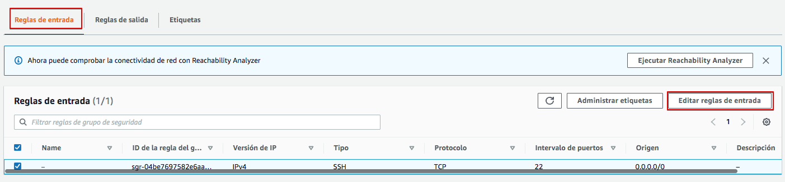
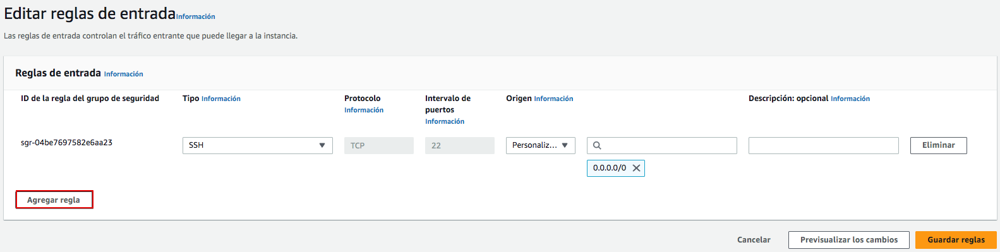
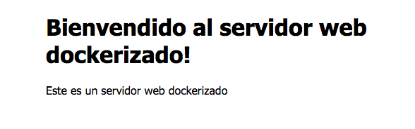

# Práctica 3.1 – Instalación y configuración de servidores web

## Instalación servidor web Nginx

Vamos a instalar el servidor Nginx en una VM Debian en AWS. Crear una nueva EC2 con las siguientes características:

* Nombre: servidorNginx
* SO: Debian
* Tipo de instancia: t2.micro
* Par de clave: el que usas habitualmente
* Grupo de seguridad:
    * crea uno nuevo y llámale "ServidorWeb"
    * de momento habilita solo acceso por SSH

Primero actualizamos los repositorios y actualizamos el sistema para después instalar el paquete correspondiente: 

```sh
sudo apt update && sudo apt upgrade

sudo apt install nginx
```

Comprobamos que nginx se ha instalado y que está funcionando correctamente: 

```sh
systemctl status nginx

```

!!!info Info
    **Esta práctica se ha hecho con Nginx 1.22.1-9**

### Comprobación de la instalación

Igual que ocurre en Apache, todos los archivos que formarán parte de un sitio web que servirá nginx se organizarán en carpetas. Estas carpetas, típicamente están dentro de `/var/www`.

Tras instalarlo podemos encontrar un ficher de muestra `/var/www/htm/index.nginx-debian.html` que nos permitirá comprobar que el sistema está funcionando correctamente. Vamos a intentar acceder al servidor web instalado usando la IP pública de la VM o bien la DNS de IPv4 pública. Puedes obtenerlas en la consola de `Instancias` de AWS.


Haz clic en cualquiera de los enlaces o copia y pega en la barra de direcciones de tu navegador web. ¿Consigues acceder al servidor? ¿Por qué crees que será? Reflexiona brevemente antes de seguir leyendo.

La respuesta es que el firewall de AWS está bloqueando los accesos. Si recuerdas, al configurar el "Grupo de seguridad" (firewall de AWS) le permitimos el acceso solo a SSH, pero no a HTTP ni a HTTPS. Vamos a hacerlo ahora. En la pestaña seguridad busca "Grupos de seguridad" y observa cómo sólo el puerto 22 (ssh) está abierto como entrada. Haz click sobre el grupo de seguridad para editarlo.


En "Reglas de entrada" vamos a "Editar reglas de entrada"



Agrega nueva regla.



Añade HTTP con origen "Anywhere-IPv4". Repite para HTTPS y "Guarda reglas"


Vuelve a intentar acceder al servidor haciendo clic sobre los enlaces en AWS. ¿Puedes acceder? Si no puedes, ¿por qué crees que será? Comprueba el protocolo con el que estás intentando acceder, ¿es http o https? Los enlaces en AWS intentan acceder al servidor usando https, pero no lo hemos activado todavía en nuestro servidor Nginx. Intenta acceder por http y si deberías acceder a la página de muestra.


Comprueba que realmente estás viendo la página `/var/www/html/index.nginx-debian.html`. Editala para que muestre tu nombre en la bienvenida.


### Comprobar registros del servidor

Comprobad que las peticiones se están registrando correctamente en los archivos de logs, tanto las correctas como las erróneas: 

+ ```/var/log/nginx/access.log```: cada solicitud a su servidor web se registra en este archivo de registro, a menos que Nginx esté configurado para hacer algo diferente. 
  
+ ```/var/log/nginx/error.log```: cualquier error de Nginx se asentará en este registro.
 
!!!info 
    Si no os aparece nada en los logs, podría pasar que el navegador ha cacheado la página web y que, por tanto, ya no está obteniendo la página del navegador sino de la propia memoria.
    Para solucionar esto, podéis acceder con el *modo privado* del navegador y ya os debería registrar esa actividad en los logs.


## Instalación servidor web Apache

El otro servidor web con más presencia en el mercado es Apache en su versión Apache2.

En esta práctica crea una nueva EC2 en AWS con estas características:

* Nombre: servidorApach
* SO: Debian
* Tipo de instancia: t2.micro
* Par de clave: el que usas habitualmente
* Grupo de seguridad: usa el que creaste para el servidor Nginx - "ServidorWeb"

!!! Atención
    En AWS puedes reutilizar servicios, como un "Grupo de seguridad". En este caso tanto nuestro servidor Nginx como el Apache2 son servidores web a los que tendremos que abrir los mismos puertos, así que podemos reutilizar el grupo de seguridad.

En esta práctica no te voy a guiar paso a paso. La instalación es tan sencilla como `nginx` pero sustituyendo en los comandos `ngnix` por `apache2`. Instala y comprueba que el servicio está en marcha.

Localiza el directorio donde Apache guarda las páginas web e identifica la página que muestra por defecto tras la instalación. Modifícala y comprueba el resultado.


## Instalación servidor Nginx dockerizado

### Instalación a partir de una imagen Ubuntu

Ahora ya sabemos instalar un servidor Nginx y crear un contenedor docker a partir de un Dockerfile. Vamos a crear un contenedor Docker a partir de una imagen Alpine instalando un servidor Nginx en su interior.

Podríamos crear un contenedor Alpine interactivo y ejecutar los comandos en su interior, pero ya aprendimos a crear un Dockerfile y hacerlo todo en un paso. Así pues, crearemos el siguiente Dockerfile:

``` 
FROM debian:latest
MAINTAINER José Muñoz <j.munozjimeno@edu.gva.es>

# Actualizamos e instalamos Nginx
RUN apt update && apt upgrade -y && apt install -y nginx && \
    rm -rf /var/lib/apt/lists/*

# Exponemos el puerto 80
EXPOSE 80

# Comando para iniciar Nginx en primer plano
CMD ["nginx", "-g", "daemon off;"]
```

Fíjate que: 

* Usamos `rm -rf /var/lib/apt/lists/*` para limpiar el tamaño de la caché y reducir el tamaño de la imagen
* La línea CMD ["nginx", "-g", "daemon off;"] asegura que Nginx se ejecute en primer plano, lo que es fundamental en Docker.

Ahora podemos crear nuestra imagen nginx a partir del Dockerfile con:

```
docker build -t servernginx .
```

Y una vez creada la imagen crear un contenedor con:

```
docker run --name=miservernginx -d -p 80:80 servernginx
```

Ahora prueba a acceder al servidor nginx dockerizado con `http://IPSERVIDOR`. Recuerda que si estás usando docker en tu máquina host puedes usas `http://localhost` pero si lo tienes en AWS tendrás que sustituir la IPSERVIDOR por la IP pública de la EC2 y asegurar que el Grupo de seguridad de esa EC2 tenga una regla de entrada que permita el acceso al puerto http - 80 -.

Para ahora y borra el contenedor creado:

```
docker stop miservernginx 

docker rm miservernginx  
```

Recordemos del tema de docker que no debíamos mantener los datos persistentes en el contenedor y que es recomendable guardarlos en un volumen docker o en un directorio de nuestra máquina host si son datos de desarrollo. Las páginas web entran dentro de esta segunda categoría, así que crearemos en nuestra máquina host un directorio para guardar las páginas web y montaremos el directorio /var/www/html del contenedor en dicho directorio.


```
mkdir -p ~/web
```

Incluye dentro de ~/web un fichero index.html que visualizaremos después y que contendrá lo siguiente:

```html
<!DOCTYPE html>
<html>
<head>
<title>Servidor dockerizado!</title>
<style>
html { color-scheme: light dark; }
body { width: 35em; margin: 0 auto;
font-family: Tahoma, Verdana, Arial, sans-serif; }
</style>
</head>
<body>
<h1>Bienvendido al servidor web dockerizado!</h1>
<p> Este es un servidor web dockerizado </p>
</body>
</html>

```

Ahora lanza nuevamente el docker run con los siguientes parámetros:

```
docker run -d --name=miservernginx \
    --mount type=bind,source=/home/admin/web,target=/var/www/html \
    -p 80:80 \
    servernginx
```

!!! Atención
    En la opción --mount estamos montando el directorio /var/www/html en el directorio host /home/admin/web. Si tu usuario no es `admin` deberás cambiarlo por tu nombre de usuario.

Deberías ver el fichero creado:



### Instalación a partir de la imagen oficial de Nginx

En el apartado anterior hemos levantado un servidor Nginx a partir de una imagen Debian y hemos realizado la instalación como haríamos en cualquier servidor linux.

Pero en dockerhub encontramos una imagen docker oficial de Nginx que puede acelerar la tarea. Y simplificarla o complicarla, ahora lo veremos.

La imagen oficial está [aquí](https://hub.docker.com/_/nginx).

Vamos a intentar crear nuestro servidor Nginx dockerizado simplemente usando el mismo comando que antes y cambiando la imagen a usar. Recuerda que los archivos html a mostrar los tenermos en `~/web`.

```console hl_lines="1 4"
docker run -d --name=miservernginx2 \
    --mount type=bind,source=/home/admin/web,target=/var/www/html \
    -p 80:80 \
    nginx:latest
```

Fíjate que hemos cambiado el nombre del servidor y la imagen que usamos. 

Parece que todo va bien. Ahora accede a `http://IPSERVER` y comprueba que ves lo siguiente:


No vemos lo que esperamos. Eso es porque la imagen nginx está mostrando un fichero html que no es `~/web/index.html`. Por tanto, estamos mapeando /var/www/html pero la imagen Nginx no busca las imágenes en ese directorio. Podríamos buscar el directorio que usa la imagen de varias formas. Una de ellas es consultar la información oficial de la imagen en DockerHub. En el apartado "How to use this image" - "Hosting som simle static content" nos dice que el uso básico es:

`docker run --name some-nginx -v /some/content:/usr/share/nginx/html:ro -d nginx`

El parámetro -v realiza la misma función que el  --mount que usamos nosotros anteriormente, montando un directorio local en uno del contenedor. Vemos que la segunda parte del parámetro es `/usr/share/nginx/html` y ese es el directorio que usa la imagen Nginx para guardar los archivos html. Por tanto, podemos crear nuestro contenedor así:


```console hl_lines="2"
docker run -d --name=miservernginx2 \
    --mount type=bind,source=/home/admin/web,target=/usr/share/nginx/html \
    -p 80:80 \
    nginx:latest
```

o bien, usando el parámetro -v que acabamos de aprender:

```console hl_lines="2"
docker run -d --name=miservernginx2 \
    -v /home/admin/web:/usr/share/nginx/html:ro \
    -p 80:80 \
    nginx:latest
```

Vemos como le añade :ro al final para hacerlo "read only" y que el contenedor solo lea los archivos en nuestro directorio local, pero no pueda modificarlos.

Comprueba si ahora el contenedor si está accediendo al directorio correcto y mostrando el archivo .html esperado.

## Comprueba lo aprendido.

Si has comprendido bien todo lo que hemos hecho hasta ahora no te será difícil lo que te voy a plantear a continuación.

Dockeriza un servidor Apache2 instalado en una máquina Debian para que muestre los archivos en `~/web`.

!!! Pistas
    Primero configura el Dockerfile para crear una imagen llamada "serverapache" con el servidor apache2

    La línea que lanza el servidor Apache2 en el Dockerfile es CMD ["apache2ctl", "-D", "FOREGROUND"]

    Crea un contenedor docker a partir de la imagen creada y comprueba que accedes a la web por defecto de Apache

    Cuando eso funcione borra el contenedor y vuelve a lanzarlo montando el directorio `~/web`. Llámale "miserverapache".

Una vez comprobado el funcionamiento para el contenedor "miserverapache".

Ahora dockeriza un servidor apache como el anterior pero usando la imagen oficial de apache en dockerhub y llámale "miserverapache2".

!!! Pistas
    El demonio de apache se llama `httpd`, así que la imagen oficial de Apache 2 en dockerhub tiene ese mismo nombre.

    El comando es similar al que usaste para el servidor Nginx pero cambiando la ruta en la que el servidor apache2 buscará los archivos html. Podrás encontrar la ruta en la documentación de la imagen httpd en dockerhub.