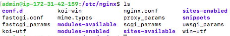

# Sitios virtuales

Un servidor web puede estar sirviendo varias páginas web que pueden pertenecer a varios usuarios. A cada una de ellas la denominaremos un "sitio virtual". Veamos cómo podemos hacer que nuestro servidor sirva varias páginas.

## El sitio web predeterminado

Cuando hemos instalado nuestro servidor web (sea Nginx o Apache2), se ha creado un sitio web predeterminado que se aloja en `/var/www/html`. Y si observamos sus permisos:

```
drwxr-xr-x  2 root root 4096 Oct 23 07:25 html
```

Por defecto esa carpeta y su contenido pertenecen a root y cualquiera puede entrar y leer. Esta es la configuración más segura si nuestro servidor web solo va a leer archivos. Pero puede plantearnos problemas si el servidor va a permitir la subida de ficheros o la modificación de archivos (por ejemplo a través de un gestor de contenido como Wordpress)

En el caso de Nginx, si ejecutamos un `ps -ef | grep nginx` observaremos 2 procesos:

```
root         415       1  0 18:13 ?        00:00:00 nginx: master process /usr/sbin/nginx -g daemon on; master_process on;
www-data     417     415  0 18:13 ?        00:00:00 nginx: worker process
```

Nginx sigue un modelo multiproceso compuesto por un proceso "master" y uno o varios procesos "workers".

* Master: inicia y controla los procesos trabajadores. Su función principal es leer la configuración de Nginx, gestionar las señales del sistema, y encargarse de la creación y supervisión de los procesos trabajadores. El usuario debe de ser root.
* Worker: son los que manejan las conexiones entrantes, procesan las solicitudes y sirven el contenido. El proceso trabajador se ejecuta bajo el usuario www-data (un usuario sin privilegios), lo que reduce el riesgo de seguridad al manejar conexiones de red.

El usuario www-data pertenece al grupo www-data. La configuración por defecto en la que `/var/www/html` pertecen a root es la más segura, pero hace necesario que sea el administrador o un usuario con privilegios (sudo) quien actualice los ficheros de la web. Lo normal es que sea un desarrollador o un usuario normal quien actualice esos ficheros. Por tanto, una práctica común es hacer que el directorio pertenezca al usuario www-data (o un usuario estándar del sistema) y al grupo www-data. Para ello podemos hacer lo siguiente:

```
sudo chown -R www-data:www-data /var/www/html
```

En cuanto a los ficheros del grupo es importante que tengan los siguientes permisos:

* Ficheros: 644 Esto permite que el propietario tenga permisos de lectura y escritura, y el grupo (es decir, www-data) y otros usuarios tengan solo permisos de lectura.
    * `sudo chmod 644 /var/www/html/index.html`

* Directorios: 755 para que el servidor web pueda leer el contenido y navegar dentro de los directorios.
    * `sudo chmod 755 /var/www/html/images`
 

Comprueba los permisos del fichero `index.nginx-debian.html` y como el servidor sigue sirviendo la página web sin problemas.

## El sitio web virtual

Al crear nuevos sitios virtuales vamos a suponer que cada sitio puede pertenecer a un usuario diferente y que solo él tendrá acceso a modificar los ficheros de su web. Vamos a hacer un ejemplo en el que seremos administradores de un servidor web que presta servicio a usuarios externos. A cada usuario le crearemos un usuario y le daremos un espacio de alojamiento para su sitio web.

Empezaremos creando un sitio virtual que llamaremos "sitio1" y será propiedad de "usuario1".

Crearemos el "usuario1" y haremos que su grupo sea www-data:

```sh
sudo useradd -m usuario1
sudo usermod -g www-data usuario1
sudo passwd usuario1    #Y le daremos passwd "usuario1"
```

En segundo lugar crearemos el espacio para el sitio virtual y le asignaremos el propietario y grupo correcto:

```sh
sudo mkdir -p /var/www/sitio1
sudo chown usuario1:www-data /var/www/sitio1
```

Y le daremos los permisos adecuados según vimos anteriormente: 

```sh
sudo chmod 755 /var/www/sitio1

```

Ahora hagamos que "usuario1" cree su primera página web `index.html` en `/var/www/sitio1` entrando como "usuario1":

```
su usuario1
nano /var/www/sitio1/index.html
```

Y copiamos el siguiente contenido

```html
<!DOCTYPE html>
<html>
<head>
<title>Sitio1!</title>
</head>
<body>
<h1>Bienvendido al sitio1!</h1>
<p> Este es el sitio1 de usuario1</p>
</body>
</html>
```

Comprueba que los permisos del fichero son 644 como comentamos anteriormente, de forma que solo usuario1 puede modificarlo pero www-data podrá leerlo.

Ahora volvemos a nuestro usuario administrador para realizar las configuraciones en Nginx para poder visualizar ese sitio virtual.

```
exit
```

## Modificamos la configuración

Los archivos de configuración de nginx los podemos encontrar en `/etc/nginx`.



En Nginx hay dos rutas importantes. La primera de ellas es **`sites-available`**, que contiene los archivos de configuración de los hosts virtuales o bloques disponibles en el servidor. Es decir, cada uno de los sitios webs que alberga el servido. La otra es **`sites-enabled`**, que contiene los archivos de configuración de los sitios habilitados, es decir, los que funcionan en ese momento. 

Dentro de `sites-available` hay un archivo de configuración por defecto (default), que es la página que se muestra si accedemos al servidor sin indicar ningún sitio web o cuando el sitio web no es encontrado en el servidor (debido a una mala configuración por ejemplo). Esta es la página que nos ha aparecido en el apartado anterior. 

Para que Nginx presente el contenido de nuestra web, es necesario crear un bloque de servidor con las directivas correctas. En vez de modificar el archivo de configuración predeterminado directamente, crearemos uno nuevo en `/etc/nginx/sites-available/nombre_web`: 

```console
sudo nano /etc/nginx/sites-available/sitio1
```

Y el contenido de ese archivo de configuración: 

```aconf
server {
        listen 80;
        listen [::]:80;
        root /var/www/sitio1;
        index index.html index.htm index.nginx-debian.html;
        server_name sitio1;
        location / {
                try_files $uri $uri/ =404;
        }
}
```

Aquí la directiva root debe ir seguida de la ruta absoluta dónde se encuentre el archivo index.html de nuestra página web.

Y crearemos un archivo simbólico entre este archivo y el de sitios que están habilitados, para que se dé de alta automáticamente. 

```console
sudo ln -s /etc/nginx/sites-available/sitio1 /etc/nginx/sites-enabled/
ls -la /etc/nginx/sites-enabled/
```

Y reiniciamos el servidor para aplicar la configuración: 

```sh
sudo systemctl restart nginx
```

## Comprobación del correcto funcionamiento

Como aún no poseemos un servidor DNS que traduzca los nombres a IPs, debemos hacerlo de forma local en nuestro equipo. Vamos a editar el archivo `/etc/hosts` <u>**de nuestra máquina anfitriona**</u> para que asocie la IP de la máquina virtual, a nuestro `server_name`.

Este archivo, en Linux, está en: `/etc/hosts`

Y en Windows: ` C:\Windows\System32\drivers\etc\hosts`

Y deberemos añadirle la línea:

 `IP_PUBLICA_SERVIDOR sitio1`
    
donde debéis sustituir la *IP_PUBLICA_SERVIDOR* por la que tenga vuestra máquina virtual.
Si queremos tener varios dominios o sitios web en el mismo servidor nginx (es decir, que tendrán la misma IP) debemos repetir todo el proceso anterior con el nuevo nombre de dominio que queramos configurar.

!!! Atención
        Recuerda dejar tu archivo `/etc/hosts` o ` C:\Windows\System32\drivers\etc\hosts` cuando finalices las comprobaciones.

## Cuestiones finales

!!!Task "Cuestión 1"
    ¿Qué pasa si no hago el link simbólico entre ```sites-available``` y ```sites-enabled``` de mi sitio web?

!!!Task "Cuestión 2"
    ¿Qué pasa si no le doy los permisos adecuados a ```/var/www/nombre_web```?

## Practica

Para ver si has comprendido bien la práctica crea un segundo sitio virtual que llamarás "sitio2" y que pertenezca al usuario "usuario2" y comprueba su funcionamiento.

## Sitios web virtuales en Apache2

En esta práctica guiada hemos visto cómo crear sitios web virtuales en Nginx. ¿Sabrías tu crear sitios web virtuales en Apache2?

Abre tu máquina virtual EC2 de AWS que creamos como "servidorApache" y crea ahí 2 sitios web virtuales como los que hemos creado en Nginx:

* sitio1 perteneciente a usuario1
* sitio2 perteneciente a usuario2

!!! Pista1
        En Apache2 hay 2 directorios que se llaman /etc/apache2/sites-available/ y /etc/apache2/sites-enabled/

!!! Pista2
        Un fichero de configuración de sitio web en Apache2 tiene esta pinta:
        ```
        <VirtualHost *:80>
                ServerName sitiovirtual
                DocumentRoot /var/www/sitiovirtual
                <Directory /var/www/sitiovirtual>
                        AllowOverride All
                        Require all granted
                </Directory>
        </VirtualHost>
        ```

!!! Pista3
        En apache no hay que crear el enlace simbólico manualmente. Hay que habilitar el sitio mediante un comando que habilita el nuevo sitio virtual y además crea el enlace. Busca cuál es ese comando.

        

