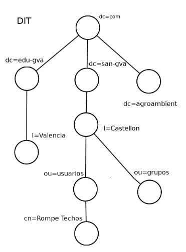
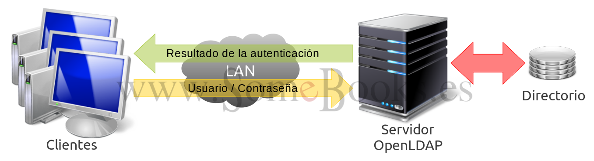

# 5.3 Servicio de directorio LDAP

## Introducción

Seguramente habrás utilizado más de una vez algún tipo de directorio o servicio de directorio, como por ejemplo: una guía telefónica impresa en papel o una revista con la programación televisiva.


Los directorios, por lo tanto, permiten localizar información y para ello definen qué información se almacenará y en qué modo.

Los directorios anteriormente comentados presentan una serie de problemas, en contra de los directorios electrónicos, a saber:

* Son estáticos: Por contra, los directorios electrónicos pueden ser consultados/actualizados en tiempo real, por lo que su fiabilidad es mucho mayor.

* Son inflexibles: en el contenido y en su organización. Por contra, los directorios electrónicos pueden modificar cualquier contenido y éste se verá reflejado al instante.

* Son inseguros: dificultad para controlar el acceso a la información. Los directorios electrónicos sí permiten controlar el acceso a la información: solamente aquel que disponga de las claves de acceso obtendrá la información.

* Difícilmente configurable: ¿Cómo hacer en la guía telefónica para realizar una búsqueda solamente sobre un segundo apellido, de una zona urbana y con teléfonos que poseen dos números que tú determines? Por contra, los directorios electrónicos pueden establecer la información que recibe una persona en función de sus necesidades.

## Utilidad de un servicio de directorio.

Por lo visto anteriormente los directorios electrónicos permiten, de forma eficiente:

* Encontrar información:
  
    Los directorios electrónicos a diferencia de los clásicos permiten acceder a la información contenida en los mismos de múltiples formas. Así, comparando con la guía telefónica tradicional, un directorio electrónico permite realizar búsquedas, no solamente por orden alfabético, sino también por: apellido: dirección, teléfono… ¿Cómo realizarías una búsqueda por teléfono en una guía telefónica tradicional?
    
    Es más, podrías sumar campos de búsqueda, como por ejemplo: dirección y apellido.

* Gestionar información:

    En los directorios electrónicos pueden existir varios usuarios que en tiempo real estén realizando modificaciones, como agregar/editar/eliminar distintos usuarios con sus correspondientes campos. Además, esta información ya estaría visible para todas aquellas aplicaciones que accedan a la misma. Centralizar así los datos en un directorio evita tener que sincronizar varios directorios, con el consiguiente riesgo que esto provoca, pues: ¿qué pasaría si la sincronización no tuvo lugar y una aplicación accede a los datos? Pues sí, obtendría los datos no actualizados, o error en los mismos.

    Un caso muy común es el de los servidores Web con autenticación: si solamente dispones de un servidor web la solución es sencilla, puesto que solamente se necesitaría actualizar una base de datos de usuarios, pero ¿y si dispones de más de un servidor web que debe acceder a la misma base de datos? Entonces, la cosa se complica, puesto que debes sincronizar a los distintos servidores. Es más, y si esa base de datos la quisiéramos aprovechar para ofrecer otro servicio distinto del de los servidores web? Pues, todo el trabajo no sería aprovechable, y por lo tanto sería mejor desde un principio adaptar este sistema a los servicios de directorios.

* Control de seguridad:

    Los servicios de directorios no simplemente permiten delimitar el acceso a los usuarios, sino que también proporcionan una solución al problema de gestión de certificados digitales. Así, permiten:

    * Su creación: Incorporar a los certificados los datos contenidos en el directorio.
    
    * Su distribución: Tener accesibles mediante un protocolo estándar los certificados.
    
    * Su destrucción: Revocar los certificados de forma sencilla simplemente borrando el certificado del directorio.

    * Su ubicación: Los usuarios pueden acceder a través del directorio a los certificados de los restantes usuarios, de forma muy sencilla y fácil de integrar con las aplicaciones.

Por todo ello las aplicaciones prácticas que poseen los servicios de directorio son muy diversas y ventajosas, como por ejemplo:
    
  * autenticación de usuarios: en aplicaciones web, correo electrónico, RADIUS..., 
  * sistemas de control de entradas a edificios, 
  * bases de datos comunes en organizaciones, 
  * en sistemas operativos: 
    * gestión de cuentas de acceso, 
    * servidores de certificados, 
    * libretas de direcciones compartidas...

## Directorio vs DNS

Tanto un servicio de directorio como un servicio DNS proporcionan acceso a una base de datos jerárquica, pero difieren en:

* Los servidores de directorio no están particularizados a una acción concreta sino orientados de forma más general, mientras que el servicio DNS está dedicado a la traducción de nombres de dominios a direcciones IP.

* La información almacenada en el servicio de directorio no es fija, mientras que en el servicio DNS tiene una estructura fija.

* El servicio de directorio permite actualizaciones, mientras que el servicio DNS no las permite, ¿o puedes actualizar a tu antojo los servidores raíz DNS?

* Los servicios de directorio suelen utilizar protocolos orientados a conexión (TCP), mientras que el servicio DNS opera con protocolos no orientados a conexión (UDP).

Pero, no por ello, poseen el impedimento de trabajar juntos, es más, usualmente los encontrarás unidos de la mano en aplicaciones web con distintas funcionalidades, como: servidores de correo, gestión de proyectos e incidencias, servidores RADIUS, etc. 

Así, suele ser necesario acceder a las URL de las aplicaciones web mediante nombres de dominio DNS y una vez en ellas autenticarse por medio de LDAP.

## ¿Qué es LDAP?

LDAP es un protocolo que ofrece el acceso a un servicio de directorio implementado sobre un entorno de red, con el objeto de acceder a una determinada información. Puede ejecutarse sobre TCP/IP o sobre cualquier otro servicio de trasferencia orientado a la conexión.

LDAP son las siglas en inglés de **Lightweight Directory Access Protocol** (Protocolo Ligero de Acceso a Directorios) y podemos considerarlo como un sistema de almacenamiento de red (normalmente construido como una base de datos) al que se pueden realizar consultas.

El protocolo LDAP se creó originalmente en la Universidad de Míchigan, que publicó un primer desarrollo en 1993. Más tarde, Tim Howes y Steve Killela, dos de los diseñadores originales del proyecto comienzan a trabajar en una nueva versión bajo los auspicios de IETF (Internet Engineering Task Force) completando el desarrollo original.

La nueva versión (LDAPv3) se publicó en 1997 e integraba mecanismos de autenticación sencilla y capa de seguridad. Después de esto, la IETF ha añadido numerosas extensiones y especificaciones propias que le han ido incorporando nuevas capacidades.

## ¿Qué es OpenLDAP?

La respuesta es muy sencilla: OpenLDAP es un desarrollo del protocolo LDAP, implementado con la filosofía del software libre y código abierto.


El proyecto OpenLDAP se inició en agosto de 1998 y está sustentado por una entidad sin ánimo de lucro llamada OpenLDAP Foundation, creada por el desarrollador estadounidense Kurt D. Zeilenga para coordinar las actividades del proyecto.

!!!Note
    OpenLDAP se publica bajo su propia licencia [OpenLDAP Public License](http://www.openldap.org/software/release/license.html)

Como ocurría en el caso de LDAP, OpenLDAP está muy optimizado para ofrecer los mejores resultados en situaciones que requieran operaciones de lectura intensivas. De esta forma, un directorio OpenLDAP arrojará unos resultados muy superiores a los que ofrece una base de datos relacional optimizada, cuando realicemos operaciones de consulta intensivas sobre ambas.

Por el contrario, si utilizáramos un directorio OpenLDAP para guardar datos que sean actualizados de manera frecuente, los resultados obtenidos serían muy inferiores a los ofrecidos por una base de datos relacional.

No sólo podemos encontrar OpenLDAP en la mayoría de de las distribuciones Linux, sino que también lo encontramos para Microsoft Windows, Apple OSX, Solaris, HP-UX, BSD, etc.

## ¿Cómo funcionan LDAP y OpenLDAP?

El modelo de información de LDAP se basa en entradas, entendiendo por entrada un conjunto de atributos identificados por un nombre global único (Distinguished Name – DN), que se utiliza para identificarla de forma específica. Las entradas se organizan de forma lógica y jerárquica mediante un esquema de directorio, que contiene la definición de los objetos que pueden formar parte del directorio. Al esquema del directorio le llamamos **DIT o Directory Information Tree**.



Cada entrada del directorio DIT representa un objeto, que puede ser abstracto o real: una persona, un mueble o una función en la estructura de una empresa, etc.

Cada nodo del DIT podemos identificarlo de 2 formas

* Relative Distinguished Name RDN, que es su nombre relativo, sin tener en cuenta en la posición del árbol en que está respecto a sus nodos padres. Por ejemplo, el primero tiene de RDN dc=com. Este puede indicar lo que se desee, por ejemplo ou=usuarios significa "unidad organizativa".

* Distinguished Name DN que es la unión de su RDN con el de sus nodos padres. Así, Rompe Techos tiene como DN cn=Rompe Techos, ou=usuarios, I=Castellon, dc=san-gva, dc=com.

Cada nodo o entrada estará formado por varios atributos. Cada atributo tendrá un tipo y un valor con el formato atributo/valor que permite caracterizar un aspecto del objeto que define la entrada. Estos atributos tienen nombres que hacen referencia a su contenido y pueden ser de dos tipos:

* Atributos normales: Son los atributos que identifican al objeto (nombre, apellidos, etc.).

* Atributos operativos: Son los atributos que utiliza el servidor para administrar el directorio (fecha de creación, tamaño, etc.).

Entre los atributos que suelen emplearse habitualmente, encontramos los siguientes, aunque puede haber muchos más:

* uid (user id): Identificación única de la entrada en el árbol.
* objectClass: Indica el tipo de objeto al que pertenece la entrada.
* cn (common name): Nombre de la persona representada en el objeto.
* givenname: Nombre de pila.
* sn (surname): Apellido de la persona.
* o (organization): Entidad a la que pertenece la persona.
* u (organizational unit): El departamento en el que trabaja la persona.
* mail: dirección de correo electrónico de la persona.

Obviamente, los atributos anteriores hacen referencia a un tipo de objeto que representa a los miembros de una empresa. Para representar a otros tipos de objetos, necesitaríamos atributos diferentes.

De esta forma, una entrada almacenada en el directorio LDAP podría tener el siguiente aspecto:

>   dn: uid=Rompe Techos, ou=usuarios, I=Castellon, dc=san-gva
    objectClass: person 
    cn: Rompe Techos
    givenname: Rompe
    sn: Techos
    o: usuarios 
    u: Castellon
    mail: rompetechos@san-gva.es

Como hemos dicho antes, las diferentes entradas se organizan a modo de árbol jerárquico que, normalmente, representa una estructura organizativa o geográfica en particular. Así, las entradas que representan comunidades autónomas aparecerán en la parte superior del árbol, debajo estarán las que representan provincias, después las ciudades, los departamentos, los usuarios, etc.

En la actualidad, las implementaciones de LDAP suelen utilizar DNS (Domain Name Service) para la estructura de los niveles superiores del árbol. En los niveles inferiores, sin embargo, las entradas representarán otro tipo de unidades organizativas, usuarios o recursos.

Por otra parte, gracias al uso de un atributo especial llamado objectClass, podemos controlar qué atributos son válidos y cuáles imprescindibles en una entrada. Los valores de objectClass establecen las reglas que debe seguir el valor de una entrada.

Lógicamente, LDAP establece operaciones para consultar o actualizar el directorio. Estas nos permiten crear o eliminar entradas y modificar entradas existentes.

La mayor parte del tiempo, LDAP se utiliza para diversas consultas sobre la información que contiene, por lo que es común que la estructura de su base de datos se encuentre optimizada para la lectura en detrimento de la escritura.

Como vemos, LDAP puede utilizarse para organizar de forma unificada el acceso a la información representativa de una red. Sin embargo, es muy frecuente que también almacene la información de autenticación para los usuarios y/o recursos. De esta forma, se facilita el control de acceso sobre los datos contenidos en el servidor.

Aunque ya hemos visto al principio un esquema de funcionamiento mucho más detallado, podríamos representar el funcionamiento de LDAP de una forma más abstracta con el siguiente esquema:



Por último, LDAP incluye servicios de integridad y confidencialidad de los datos que contiene.

## Integración del servicio de directorio con otros servicios.

De lo expuesto anteriormente puede deducirse que el servicio de directorio es importante en sí mismo, pero es fundamental para aglutinar información que puede ser fuente de objeto para desplegar nuevos servicios basados en la cooperación entre las distintas aplicaciones y el servicio de directorio.

Así, el servicio de directorio puede actuar como servidor de autenticación, proporcionando el servicio de contraseña única. Además puede contener información necesaria para que los distintos servidores puedan decidir si un usuario puede acceder a determinada información.

Puedes utilizar el servicio de directorio como repositorio en el cual almacenar la información que varios servidores deben compartir, por ejemplo: la configuración, información sobre el control de acceso, etc.

## El formato de intercambio de datos LDIF

El formato LDIF es el estándar para representar entradas del directorio en formato texto ASCII, que posee la siguiente sintaxis:

```
dn: <nombre distinguido>
<nombre_atributo>: <valor>
<nombre_atributo>: <valor>
<nombre_atributo>: <valor>
```

Así, una entrada del directorio en formato de intercambio de datos LDIF consiste en dos partes:

* El DN que debe figurar en la primera línea de la entrada y que se compone de la cadena dn: seguida del nombre distinguido (DN) de la entrada.

* Los atributos de la entrada.
  * Cada atributo se compone de un nombre de atributo, seguido del carácter dos puntos ':' y el valor del atributo. 
  * Si hay atributos multivaluados deben ponerse seguidos.
  * No existe ningún orden preestablecido para la colocación de los atributos, pero es conveniente listar primero el atributo objectclass, para mejorar la legibilidad de la entrada.

En un archivo LDIF puede haber mas de una entrada definida, cada entrada se separa de las demás por una línea en blanco. A su vez, cada entrada puede tener una cantidad arbitraria de pares `<nombre_atributo>:<valor>`.

Este formato es útil tanto para realizar copias de seguridad de los datos de un servidor LDAP, como para importar pequeños cambios que se necesiten realizar manualmente en los datos, siempre manteniendo la independencia de la implementación LDAP y de la plataforma donde esté instalada.

A continuación puedes observar un ejemplo de una entrada para describir una cuenta de usuario en un servidor:

```
dn: uid=upruebas,ou=People,dc=ejemplo,dc=com
objectclass: account
objectclass: posixAccount
objectclass: topuid: upruebas
cn: Usuario Pruebas
loginshell: /bin/bash
uidnumber: 512
gidnumber: 300
homedirectory: /home/upruebas
gecos: Usuario Pruebas
userpassword: 123456
```

Crearíamos un archivo de texto con la extensión ldif, por ejemplo `usuariopruebas.ldif` y lo añadiríamos con el comando `ldapadd`.

Lo veremos en detalle en la práctica. 


## Referencias

[Servicios de red implicados en el despliegue de una aplicación web.](https://sarreplec.caib.es/pluginfile.php/10993/mod_resource/content/2/DAW05_v1/ArchivosUnidad/Moodle/DAW05_completa_offline/DAW05_Contenidos/index.html)

[Sistemas Operativos en Red](http://somebooks.es/sistemas-operativos-en-red/) - Capítulo 11. Instalar y configurar OpenLDAP