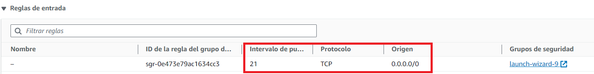
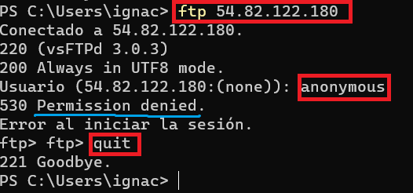
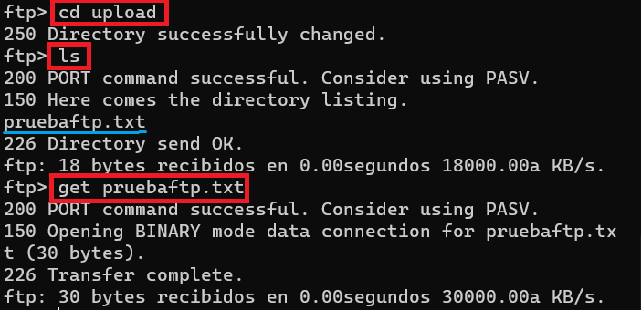
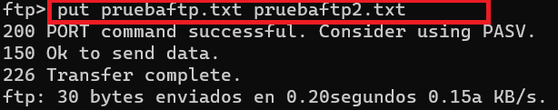
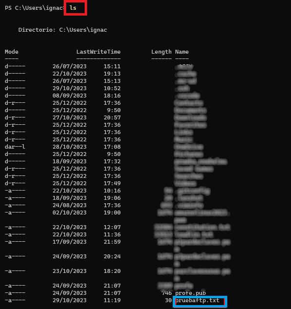

# Práctica 2 - Instalar y Configurar el servidor vsFTPd sin cifrado.

En esta práctica, aprenderemos cómo instalar y configurar un servidor FTP usando vsFTPd en un servidor basado en Debian. En esta primera práctica configuraremos el servidor como FTP sin cifrado. Es una manera de configuración insegura que usaremos solo desde un punto de vista didáctico.


**Información básica sobre el servidor vsFTPd (Very Secure FTP Daemon):**

Hoy en día existe una amplia gama de servidores FTP de código abierto, como FTPD, vsFTPd, PROFTPD y pureftpd. Entre todos ellos, vsFTPd es un protocolo muy seguro, rápido y el más utilizado para transferir archivos entre dos sistemas. vsFTPd también se conoce como «Demonio de Protocolo de Transferencia de Archivos Muy Seguro» con soporte de SSL, IPv6, FTPS explícito e implícito.

Archivos y directorios que se crean en el sistema:

- El archivo `/etc/init.d/vsftpd` es el script de inicio en sistemas basados en Linux que permite administrar el servicio vsftpd, a través de  tareas como iniciar, detener, reiniciar y administrar el servicio de FTP. Por ejemplo un comando para iniciar el servicio en Ubuntu sería este: `systemctl start vsftpd` , entre otros (stop, restart, reload, status).
- El archivo `/usr/sbin/vsftpd` este archivo es el binario principal que se utiliza para iniciar y ejecutar el servidor vsFTPd. Es responsable de escuchar en el puerto FTP (por lo general, el puerto 21) y gestionar las conexiones de los clientes FTP. Este archivo lee la configuración del archivo `/etc/vsftpd.conf` al iniciarse para personalizar el comportamiento del servidor FTP. 
- El archivo `/etc/vsftpd.conf` es el archivo de configuración principal del servidor vsFTPd donde se especifican numerosos parámetros de configuración que controlan el comportamiento y la seguridad del servidor FTP.
- El directorio `/srv/ftp` este directorio raíz por defecto del servidor FTP, que se utiliza para organizar y administrar los archivos y directorios que están disponibles para los usuarios que se conectan al servidor FTP. Es donde se alojarán los archivos para usuarios anónimos (accesos anónimos) sino se indica lo contrario en la configuración.
- El archivo `/etc/ftpusers` tiene como función denegar el acceso a ciertos usuarios, evitando que puedan autenticarse y utilizar los servicios de FTP.
- El archivo `/etc/vsftpd.user_list` se utiliza para controlar el acceso permitido a un grupo específico de usuarios. Este archivo no se instala, por lo cual hay que crearlo antes de comenzar a trabajar con la configuración.
- El archivo `/etc/vsftpd.chroot_list` tiene como propósito principal controlar qué usuarios pueden ser "encarcelados" en sus respectivos directorios de inicio (chroot) cuando se conectan al servidor FTP.
- El archivo `/var/log/vsftpd.log` es un archivo de registro útil para el monitoreo, la solución de problemas y la auditoría de actividades en el servidor FTP.

  Para más información puedes consultar la comunidad vsFTPd : [https://help.ubuntu.com/community/vsftpd](https://help.ubuntu.com/community/vsftpd)

Vamos a empezar a trabajar. 

## Creamos una instancia AWS

Vamos a instalar el servidor vsFTPd en una VM Debian en AWS. Crear una instancia nueva que llamarás **P4-vsFTPd**

**Añade una Regla de Entrada:**
En la pestaña "Reglas de entrada", debes añadir una regla para permitir el tráfico en el puerto FTP que necesitas. 

- Para FTP no cifrado (puerto 21), crea una regla con el protocolo TCP y el puerto 21.
- Para FTPS o SFTP con cifrado (puerto 22), también crea una regla con el protocolo TCP y el puerto 22.

Asegúrate de especificar la fuente del tráfico, lo que puede ser tu propia dirección IP si deseas acceder al servidor FTP desde tu ubicación actual o cualquier otra fuente si deseas permitir el acceso desde cualquier lugar (ten en cuenta que esto puede ser menos seguro).



Ahora vamos a instalar y configurar vsFTPd para el acceso de usuarios locales (es decir, usuarios que existen en el sistema operativo donde está instalado el servidor FTP), que solo podrán acceder a su carpeta de usuarios (chroot). Además les permitiremos subir ficheros.

## Paso 1. Instalación del servidor vsFTPd 

En primer lugar, actualizaremos los repositorios de Ububtu y a continuación instalaremos el **servidor vsFTPd** :

```sh
sudo apt-get update && sudo apt-get upgrade
sudo apt-get install vsftpd
```

Se crea el usuario *ftp* dentro del fichero **/etc/passwd**, y el grupo *ftp* en **/etc/group** del Servidor Linux. Puedes comprobarlo visualizando ambos ficheros.

```sh
cat /etc/passwd
cat /etc/group
```

Para comprobar que el servidor se ha iniciado comprobamos que el servicio está en marcha:

```sh
systemctl status vsftpd
```

También podríamos comprobar que el proceso vsftpd está funcionando.

```sh
ps -ef | grep vsftpd
```
Vemos que aparecen el proceso con el archivo de configuración  **/etc/vsftpd.conf** y el archivo ejecutable principal del servidor FTP vsFTPd **/usr/sbin/vsftpd** 

## Paso 2. Configuramos usuario de pruebas.

Recordamos de la teoría que el servidor FTP puede configurarse para que lo usen 3 tipos distintos de usuarios:

1. Usuario anónimo
2. Usuarios locales (del sistema)
3. Usuarios virtuales (independientes de los del sistema y creados por el administrador)

En este módulo de Despliegue de aplicaciones nos interesa usar FTP para subir nuestros ficheros al servidor donde está alojado nuestro servidor web o servidor de aplicaciones, así que no nos interesa mucho configurar el usuario anónimo. Nos centraremos en trabajar con usuarios locales, que nos ofrece la funcionalidad que necesitamos.

Empezaremos por crear un usuario que llamaremos `userftp` y que utilizaremos el resto de la práctica para transacciones FTP. Utilizando este usuario iniciaremos la sesión en el servidor FTP más adelante. Estableceremos como contraseña "_ieselcaminas_".

```sh
sudo adduser userftp
```

<!---COMENTAMOS ESTA PARTE
2. Agregamos el nuevo usuario `userftp` a la lista de usuarios de FTP permitidos.

```sh
echo "userftp" | sudo tee -a /etc/vsftpd.userlist
```
3. Crearemos un directorio FTP y de archivos de datos para este nuevo usuario.

Este paso lo realizamos cuando se desea un directorio diferente como raíz FTP (recuerda que el que tiene por defecto el servidor ftp es  `/srv/ftp`) y otro diferente para cargar archivos para sortear la limitación de chroot jail.

Creamos la carpeta FTP. 
```sh
sudo mkdir /home/userftp/ftp
```
Establecemos la propiedad de esta carpeta de la siguiente forma;
  
```sh
sudo chown nobody:nogroup /home/userftp/ftp
```
Donde `nobody` es un usuario que generalmente tiene permisos mínimos y se utiliza para ejecutar servicios o procesos que no deben tener acceso a recursos del sistema y `nogroup` es un grupo que también se utiliza para limitar el acceso a recursos y archivos.

También debemos eliminar los permisos de escritura en la carpeta.
```sh
sudo chmod a-w /home/userftp/ftp
```

Antes de continuar, vamos a verificar los permisos.
```sh
sudo ls -al /home/userftp/ftp
```

Ahora vamos a crear el **directorio de escritura real para los archivos**, donde se puedan subir los archivos. Le vamos a dar la propiedad al usuario creado `userftp` y le damos todos los permisos

```sh
sudo mkdir /home/userftp/ftp/upload
sudo chown userftp:userftp /home/userftp/ftp/upload
sudo chmod -R 777 /home/userftp/ftp/upload
```
Comprueba los permisos.

```sh
sudo ls -al /home/userftp/ftp
```
Finalmente, agregamos un archivo `pruebaftp.txt` para usar en las pruebas.

```sh
echo "esto es una prueba con vsftpd" | sudo tee /home/userftp/ftp/upload/pruebaftp.txt
```
-------------------------------------------------------------------------
--->

## Paso 3. Configuración del servidor vsFTPd

Ahora repasaremos algunas configuraciones importantes para que vsFTPd funcione. Para ello buscamos el archivo de configuración y guardamos una copia de él por si acaso: 

```sh
sudo cp /etc/vsftpd.conf /etc/vsftpd.conf.backup
```
Comienza abriendo el archivo de configuración.

```sh
sudo nano /etc/vsftpd.conf
```

Ahora vamos a ir probando distintas configuraciones y veremos cómo afectan a la funcionalidad.

**1. Acceso FTP a usuarios locales**

En este tutorial, permitiremos el acceso FTP solo a los usuarios locales y deshabilitaremos cualquier acceso anónimo. Esta es la configuración por defecto cuando instalamos vsftpd. Comprueba estas 2 líneas en el fichero `/etc/vsftpd.conf`

```yaml
  anonymous_enable=NO #(1)
  local_enable=YES #(2)
```

1. No permitimos el acceso anónimo
2. Permitimos el acceso de los usuarios del sistema

Guarda el fichero, y reinicia el servicio vsftpd para habilitar la configuración realizada.

```sh
sudo systemctl restart vsftpd
```
A continuación, asegúrate de que el servicio vsftpd está en su estado de ejecución ejecutando el siguiente comando en el Terminal:

```sh
sudo systemctl status vsftpd
```

Recuerda para volver al prompt , debes pulsar q  

Prueba a conectarte con el usuario `userftp` con tu cliente FTP. 


!!!Atención
    Si tienes problemas con la conexión recuerda que FTP tiene 2 modos, activo y pasivo y que en función de la configuración del firewall de servidor y cliente puede ser más adecuado uno que otro.

**2. Habilitar modo de conexión activa/pasiva** 

VSFTPD usa el modo activo de FTP de manera predeterminada, lo que puede causar problemas de conexión cuando los clientes de FTP usan el modo pasivo en su lugar. Lo que podemos hacer es habilitar en el Cliente FTP la opción de conexión activa o habilitar en nuestro servidor vsftpd el modo pasivo, como se realiza en la práctica siguiente.

Una vez ya te has conectado al servidor prueba a moverte por los distintos directorios del equipo  _¿Tienes alguna restricción? ¿Puedes acceder a cualquier directorio? ¿Has probado a acceder a /root? ¿Te puedes descargar /etc/vsftpd.conf? ¿Puedes subir un archivo de tu equipo local a /home/userftp en el servidor?_

**3. Habilitar la carga de archivos**

Lo más probable es que la respuesta a la última pregunta fuera no. Por defecto la carga de ficheros al servidor está deshabilitada. El propósito singular más importante de FTP aquí es poder escribir en el servidor. Descomenta la siguiente línea para habilitar la carga de archivos eliminando # delante de ella.

```linuxconfig
  write_enable=YES
```

Reinicia nuevamente el servidor. Prueba a cargar en /home/userftp el archivo /etc/vsftpd.conf que intentaste descargaste antes. ¿Ahora puedes? ¿Y con qué permisos se carga el fichero en la carpeta?

Prueba a cargarlo en /etc. ¿Puedes? ¿Por qué no?

**4. Permisos de los archivos subidos**

Al subir el fichero vsftpd.conf a /home/userftp los permisos son estos, ¿verdad?

`-rw-------` o dicho en octal `600`.

Si buscas en el fichero de configuración verás que habla de "umask" y dice esto

```yaml
# Default umask for local users is 077. You may wish to change this to 022,
# if your users expect that (022 is used by most other ftpd's)
#local_umask=022
```

Nos dice que umask es 077, pero los permisos del fichero que hemos subido son 600. ¿Qué pasa aquí? Los permisos por defecto al subir un fichero son 666 (rw-rw-rw- o 110110110) y a esos permisos se les hace un AND con la máscara definida con umask ¡pero negada! Si la umask es 077 (---rwxrwx o 000111111) y la negamos obtenemos 700=111000000. Si hacemos el AND obtenemos:

```
110110110 = 666
111000000 = 700
---------
110000000 = 600
```

Y aquí tenemos el 600 o rw------- que nos había salido antes. 

En los servidores FTP lo habitual es que la umask sea 022. ¿Qué permisos tendrá un fichero al subirlo con esa máscara?

Prueba a descomentar esta línea, reinicia el servicio, sube un fichero a `/home/userftp` y compruéba sus permisos. Esto será importante para cuando subas una página web al servidor web usando FTP. Recuerda que los ficheros necesitaban unos permisos concretos para que pudieran visualizarse.


**5. Cárcel de Chroot para los usuarios locales**

Como vimos antes el usuario, al conectarse por FTP podía navegar por todo el sistema de archivos. Esto no es muy recomendado y podemos hacer el usuario que está restringido a un directorio determinado. 
El servidor vsFTPd logra eso usando chroot jails, de manera que cuando chroot está habilitado para usuarios locales, estos usuarios están restringidos a sus directorios de inicio de forma predeterminada. Para lograr esto, cambiamos la configuración con las propiedades siguientes:

```linuxconfig
chroot_local_user=YES
```
Para evitar cualquier vulnerabilidad de seguridad, **cuando chroot está habilitado**, no funcionará si el directorio raíz al que se conectan los usuarios es escribible. Por tanto, si no hacemos nada más e intentamos conectarnos veremos que no nos deja, ya que `userftp` si puede escribir en su directorio home: `/home/userftp`. Para sortear esta limitación, tenemos varias opciones de configuración:

- Opción 1 – Simplemente permitir que el directorio raíz al que nos conectamos sí pueda ser escribible.

  En ese caso, agregamos la siguiente línea. Haz la prueba, reinicia vsftpd e intenta conectarte. Después deshabilita esta opción, ya que no es la que usaremos.

```linuxconfig
allow_writeable_chroot=YES
```

- Opción 2 – Definir un directorio de acceso por FTP distinto al home del usuario y sin permisos de escritura.

Se debe utilizar un directorio diferente para cargas FTP. Crearemos un directorio `/home/userftp/ftp` al que quitaremos los permisos de escritura para todo el mundo que servirá como chroot. Pero antes de quitarle los permisos de escritura, crearemos un segundo directorio `/home/userftp/ftp/upload` para la carga de archivos, este sí tendrá permisos de escritura. Para configurar esta opción de chroot, agregamos las siguientes líneas al fichero de configuración.

```linuxconfig
user_sub_token=userftp
local_root=/home/userftp/ftp
```
Prueba a conectarte por ftp con el usuario `userftp` y comprueba que su directorio raíz ahora es `/home/userftp/ftp` y que ahí no puedes subir ningún fichero. Prueba a subir a `upload` y comprueba que en este directorio sí puedes.

En el caso anterior servirá solo para el usuario `userftp`. Si lo queremos hacer para todos los usuarios del sistema usaremos estas directivas en su lugar :

```linuxconfig
user_sub_token=$USER
local_root=/home/$USER/ftp
```

Ahora crea un segundo usuario, por ejemplo `user2`. Crea los directorios `/home/user2/ftp` sin permiso de escritura y `/home/user2/ftp/upload` con permiso de escritura. Conéctate con `user2` y comprueba lo dicho anteriormente.

Elimina las directivas `user_sub_token` y `local_root` para probar la opción 3.

- Opción 3 – Enjaular al usuario en otra carpeta distinta, por ejemplo /var/www

Suele ser normal querer que el usuario pueda ver un directorio distinto al de su home, como por ejemplo la carpeta www o la de un servidor virtual concreto de apache, para ello, la solución más rápida es cambiar el directorio home del usuario de la siguiente forma. Para hacer esta prueba, antes instala APACHE si no estaba instado.

```linuxconfig
sudo usermod --home /var/www userftp
```

Comprobamos con:

```linuxconfig
su userftp
cd
pwd
```

Vuelve al usuario admin con `exit`.

Con esto habremos cambiado el directorio home del usuario y cada vez que se conecte tanto por FTP como por SSH entrará al directorio /var/www. Compruébalo. Si quisieramos subir archivos a la web sólo nos quedaría, para este caso, añadir el usuario al grupo de apache o www-data dependiendo del sistema operativo o el usuario apache configurado.

```linuxconfig
sudo adduser userftp www-data
```

**6. Restricción de usuarios**

Para permitir que sólo ciertos usuarios inicien sesión en el servidor FTP, agregamos las siguientes líneas en la parte inferior. Con esta opción habilitada, debemos especificar qué usuarios deberían poder usar FTP y agregar sus nombres de usuario en el archivo `/etc/vsftpd.userlist`.

```yaml
userlist_enable=YES #(1)
userlist_file=/etc/vsftpd.userlist #(2)
userlist_deny=NO #(3)
```

1. Hace que solo puedan conectarse o impide que se puedan conectar los usuarios de la lista
2. Lista donde se definen qué usuarios pueden conectarse o no conectarse
3. Si el valor es YES a los usuarios de la lista se les deniega el acceso. Si es NO se les permite

Agregamos el nuevo usuario `userftp` a la lista de usuarios de FTP permitidos, con este comando o con nano.

```sh
echo "userftp" | sudo tee -a /etc/vsftpd.userlist
```

Guarda y cierra el archivo. Reinicia el servidor e intenta conectarte con `userftp`. Comprueba que funciona. Intenta conectarte ahora con `user2`. ¿Te lo permite?

Después de todas estas pruebas vamos a dejarlo de la siguiente manera para las comprobaciones finales:

1. Deja que sólo puedan conectarse los usuarios locales.
2. Habilita la carga de archivos.
3. Haz que los archivos se suban con umask 022.
4. Habilita chroot con la opción 2, es decir, que cada usuario del sistema se conecte a `/home/$USER/ftp`
5. Restringe para que solo `userftp` pueda conectarse por FTP
6. Agrega un archivo `pruebaftp.txt` en `/home/userftp/ftp/upload/` para usar en las pruebas.
   
  ```sh
  echo "esto es una prueba con vsftpd" | sudo tee /home/userftp/ftp/upload/pruebaftp.txt
  ```

## Paso 4: Comprobación del acceso FTP

Nuestro servidor FTP es completamente funcional en este momento. Podemos hacer una pequeña prueba antes de continuar.

Intentemos iniciar sesión como un usuario anónimo. Vemos que funciona según lo previsto, es decir, no se permiten usuarios anónimos.



Ahora vamos a conectarnos como usuario de prueba `userftp` que creamos para acceder al servidor FTP. 


Cambiemos al directorio de carga y usemos el comando get para transferir el archivo de prueba a nuestra máquina local.



A continuación, subamos el archivo con un nuevo nombre usando el comando put para probar los permisos de escritura del archivo.



Cierra la conexión.
```
ftp> bye
```

Finalmente comprobación que la descarga se ha producido.

Comprobamos que el archivo se ha descargado correctamente en nuestra máquina local.
La descarga la dejará en la misma carpeta donde se haya producido la conexión ftp. En nuestro caso, la misma carpeta que nos encontremos al salir con el quit.



## Referencias

* [vsftpd - Ubuntu documentation](https://help.ubuntu.com/community/vsftpd)
* [VSFTPD: Instalación y chroot a una carpeta de usuario.](https://kimerikal.com/vsftpd-instalacion-y-chroot-a-una-carpeta-de-usuario/)
* [How To Set Up vsftpd for a User's Directory on Ubuntu 16.04](https://www.digitalocean.com/community/tutorials/how-to-set-up-vsftpd-for-a-user-s-directory-on-ubuntu-16-04)
