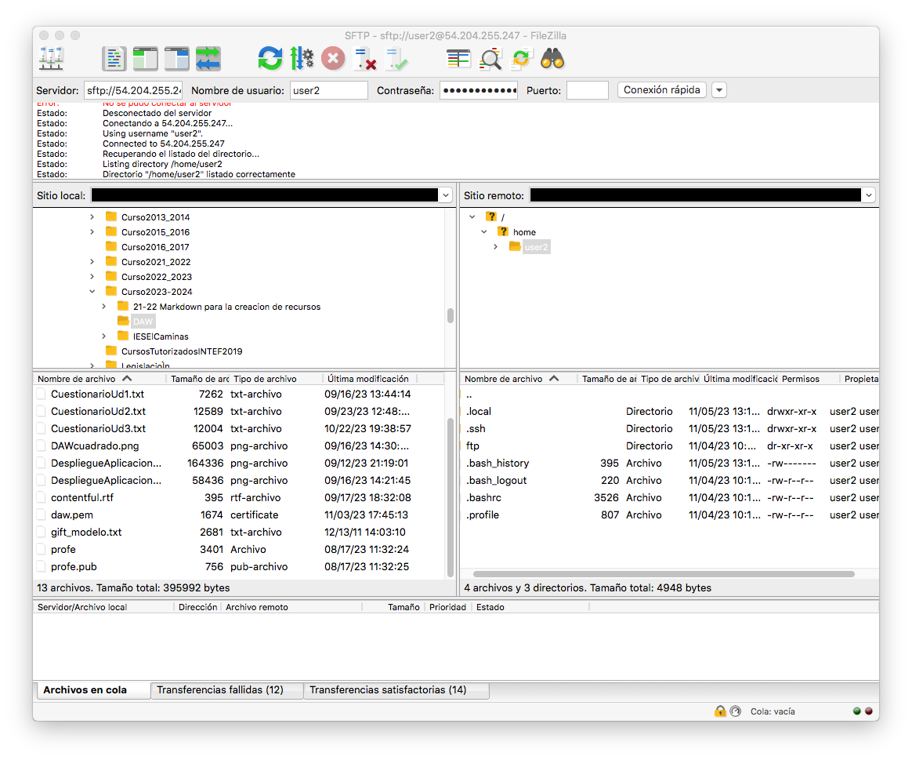

# Práctica 4.3- Configuración de servidor FTP con Cifrado

En esta práctica, aprenderemos cómo asegurar la conexión usando el protocolo SSL/TLS, de esta forma se podrán transferir datos encriptados a través de FTP.

Recuerda de la teoría que hay 2 modos de conexión cifrada de FTP, FTPS y SFTP y que no tienen nada que ver en cuanto a configuración y funcionamiento.

* FTPS (File Transfer Protocol Secure) - Es a FTP lo que HTTPS a HTTP. Es el servidor FTP quien define sus claves pública y privada. Comparte su clave pública con el cliente que quiere conectarse a él para establecer el canal privado. Por tanto requiere de la generación de dichas claves en el servidor y la configuración en vsftpd.conf. Además tiene 2 formas de conexión
    * FTPS Explícito (FTPES): En este modo, la seguridad SSL/TLS se inicia después de que el cliente se conecta al servidor y emite un comando específico (por ejemplo, AUTH TLS o AUTH SSL) para solicitar una conexión segura. Por tanto la primera conexión del cliente al servidor es por el puerto habitual de comandos de FTP, el 21.
    * FTPS Implícito (FTPIS): En este modo, la seguridad SSL/TLS se establece automáticamente cuando el cliente se conecta al servidor en un puerto específico (generalmente el puerto 990 para FTPS implícito).
* SFTP (SSH File Transfer Protocol) - Aquí primero se establece un canal SSH entre cliente y servidor SSH (no vsftpd) a través del puerto habitula ssh, el 22.. Una vez establecido el canal el cliente ftp y vsftpd intercambian mensajes cifrados dentro de ese canal. Por tanto, vsftpd no necesita ninguna configuración especial

En esta práctica veremos las 2 formas de funcionamiento y conexión.

## Instancia en AWS 

Primero abriremos la instancia AWS P4-vsftpd creada en la práctica anterior, donde ya teníamos instalado el servidor vsftpd y usuarios con permisos a FTP.


## Servidor vsftpd 

Comprobamos el estado del servicio y en caso de que no esté habilita el servicio al inicio.

```sh
sudo systemctl status vsftpd
```

En caso de que no esté iniciado el servicio, realizar estos pasos;

```sh
sudo systemctl start vsftpd
sudo systemctl enable vsftpd.service
```

## FTPS (File Transfer Protocol Secure)

Veamos primero la configuración y conexión a través de FTPS.

### Generar un certificado autofirmado con OpenSSL 

Ya hemos visto que el servidor vsftpd admite FTPS (FTP sobre SSL/TLS), es decir que cifra las comunicaciones entre el cliente y el servidor. Así que para poder transferir datos encriptados a través de FTP, necesitaremos crear un certificado SSL y habilitar la conexión SSL/TLS. Por ello vamos a utilizar OpenSSL con el siguiente comando;

```sh
sudo openssl req -x509 -nodes -days 365 -newkey rsa:2048 -keyout /etc/ssl/private/vsftpd.pem -out /etc/ssl/private/vsftpd.pem
```
Tenemos que tener en cuenta que nos pedirá que ingresemos cierta información, como el país, el estado/provincia y el nombre común. Puede ingresar los valores que desee o dejarlos en blanco.

Este comando genera un certificado SSL autofirmado válido por 365 días y guarda la clave privada y el certificado en `/etc/ssl/private/vsftpd-cert.pem`

Podemos comprobarlo con el comando 
```sh
sudo ls -l /etc/ssl/private
```


### Habilitar el cifrado SSL

Una vez que tengamos el certificado SSL y la clave privada, tendremos que modificar el archivo /etc/vsftpd.conf. Para ello buscamos el archivo de configuración y guardamos una copia de él por si acaso: 

```sh
sudo cp /etc/vsftpd.conf /etc/vsftpd.conf.backup2
```
Pasamos a modificar el archivo de configuración utilizando un editor.

```sh
sudo nano /etc/vsftpd.conf
```
En primer lugar, buscaremos las siguientes líneas del archivo y las **eliminaremos o comentaremos con #**:

```linuxconfig
rsa_cert_file=/etc/ssl/certs/ssl-cert-snakeoil.pem
rsa_private_key_file=/etc/ssl/private/ssl-cert-snakeoil.key
ssl_enable=NO
```
Tras ello, **añadiremos** estas líneas en su lugar;

```linuxconfig 
rsa_cert_file=/etc/ssl/private/vsftpd.pem
rsa_private_key_file=/etc/ssl/private/vsftpd.pem
ssl_enable=YES

allow_anon_ssl=NO
force_local_data_ssl=YES
force_local_logins_ssl=YES
ssl_tlsv1=YES
ssl_sslv2=NO
ssl_sslv3=NO
require_ssl_reuse=NO
ssl_ciphers=HIGH
```

Al conectarnos utilizando FTPS el servidor forzará al cliente a realizar una conexión pasiva por segurida, como vimos en la teoría. Si no hacemos nada más, tras el primer intercambio de órdenes a través del puerto 21, la conexión no podrá establecerse por el puerto de datos y obtendremos un mensaje similar a este "El servidor envió una respuesta pasiva con una dirección no enrutable. Usando en su lugar la dirección del servidor."

Para evitar que esto ocurra, definiremos los puertos que puede abrir el servidor para el canal de datos en la conexión pasiva en el fichero /etc/vsftpd.conf con las siguientes órdenes:

```linuxconfig
pasv_enable=YES
pasv_min_port=1027  # Puerto mínimo de conexión pasiva (reemplaza XXXX con un número)
pasv_max_port=1030  # Puerto máximo de conexión pasiva (reemplaza XXXX con un número)
pasv_address=X.X.X.X  # Dirección IP pública o accesible desde el cliente (reemplaza X.X.X.X con la dirección IP)
```
En este caso hemos elegido los puertos 1027 a 1030, pero puedes elegir otros que estén libres. Ten en cuenta que deberás abrir esos puertos en el firewall de AWS para permitir conexiones a esos puertos.

La última línea pasv_address=X.X.X.X es opcional y si la pones debes poner la IP pública de tu servidor. Si no la pones, cuando te conectes con el cliente recibirás un mensaje similar a "*El servidor envió una respuesta pasiva con una dirección no enrutable. Usando en su lugar la dirección del servidor.*", pero funcionará igual. Si la pones ten en cuenta que cada vez que cambie la IP pública de tu servidor deberás cambiar esta línea en la configuración.


### Reinicia el servicio

Finalmente reiniciamos el servicio vsftpd para que coja la nueva configuración realizada en todos estos pasos.

```sh
sudo systemctl restart --now vsftpd
```

### Comprobar la Conexión FTP al servidor vsftpd

#### Acceso con Cliente FTP de consola

1. Abre una terminal en tu sistema. 
- Desde Linux/Mac, abre el terminal del sistema
- Desde Windows, abre el "Símbolo del sistema" o "PowerShell". Puedes hacerlo buscando "cmd" o "PowerShell" en el menú de inicio o escribiendo "cmd" en la barra de búsqueda.

2. En la terminal, escribe el siguiente comando para iniciar una sesión FTP. Debes reemplazar *nombre_de_host_ftp* con la dirección IP PÚBLICA o el nombre de dominio del servidor FTP al que deseas conectarte:

```
ftp nombre_de_host_ftp
```

3. Una vez que ingreses el comando, el cliente FTP intentará establecer una conexión con el servidor. Si la conexión es exitosa, verás un mensaje similar a este:

```
Connected to nombre_de_host_ftp.
220 (nombre_del_servidor_ftp) FTP server ready
Name (nombre_de_host_ftp:tu_nombre_de_usuario_ftp):
```

4. A continuación, el cliente FTP te pedirá que ingreses un usuario (en nuestro caso recuerda que era **userftp**)  y presiona "Enter". Luego, se te pedirá que ingreses la contraseña (recuerda que era **ieselcaminas**). Si las credenciales son correctas, deberías obtener acceso al servidor FTP. Verifica que el prompt a cambiado a ftp> (quiere decir que has conectado correctamente). Es posible que si el cliente ftp no conoce el certificado del servidor no te permita la conexión. Si esto ocurre no te preocupes e intenta la conexión con el cliente gráfico, que suele solucionar ese inconveniente.

#### Acceso con Cliente FTP gráfico 

Vamos a utilizar como **cliente FTP** con entorno gráfico a [Filezilla](https://filezilla-project.org/), que dispone de versiones para GNU/Linux, Mac OS X y Windows. Tras descargar <U>**el cliente FTP**</u> en nuestro ordenador, introducimos los datos necesarios para conectarnos a nuestro servidor FTP en Debian:


+ La IP de Debian (recuadro rojo)
+ El nombre de usuario de Debian (recuadro verde)
+ La contraseña de ese usuario (recuadro fucsia)
+ El puerto de conexión, que será el 21 para conectarnos utilizando los certificados generados previamente (recuadro marrón)

Tras darle al botón de *Conexión rápida*, nos saltará un aviso a propósito del certificado, le damos a aceptar puesto que no entraña peligro ya que lo hemos genrado nosotros mismos:


Nos conectaremos directamente a la carpeta que le habíamos indicado en el archivo de configuración `/home/userftp/ftp`

Si en lugar de usar la conexión gráfica queremos crear una conexión para usarla más adelante lo haremos siguiendo los pasos de la práctica 4.1 Acceso a un servidor FTP público con los siguientes datos:


Fíjate que usamos FTP y no SFTP, que usamos FTPS Explícito y que el puerto está vacío, porque usará el 21, que es el puerto por defecto. Puedes ponerlo y verás que funciona igual.

## SFTP (SSH File Transfer Protocol)

Ahora vamos a probar la conexión por SFTP. Recuerda que para esta no necesitamos configurar vsftp de ninguna forma especial, así que vamos a recuperar el fichero de configuración antes de configurar FTPS. Antes guardaremos el fichero de configuración con ftps activado por si queremos usarlo después.

```sh
sudo cp /etc/vsftpd.conf /etc/vsftpd.conf.ftps
sudo cp /etc/vsftpd.conf.backup2 /etc/vsftpd.conf
```

Ahora recuerda que aquí primero se establece una conexión ssh entre el usuario y el servidor ssh usando las claves pública y privada del usuario. Vamos a usar en este caso el usuario `user2`. Puedes crear un par de claves pública y privada para este usuario como hicimos en la práctica 1.3 y configurar el servidor ssh en la máquina virtual en AWS para que user2 pueda conectarse con ssh usando su clave privada. 


Cuando lo tengas, lo primero es probar que funciona antes de intentar la conexión SFTP.

```sh
ssh -i clave user2@ipserver
```

Recuerda cambiar clave por el nombre y ruta del fichero de clave privada generado y ipserver por la ip pública de tu servidor en AWS. 

Una vez comprobado que funciona ya podemo intentar conectar por sftp.

### Conexión en modo comando

Probamos a conectarnos en modo comando.


Si todo va bien se establecerá la conexión sin pedirnos usuario ni contraseña.

### Conexion en modo gráfico.

Si lo que quisiéramos es conectarnos con Filezilla mediante la conexión rápida, bastará con seleccionar el puerto 22, que recordemos es el de ssh. Para que esto funcione el archivo de clave privada deberá estar en la ubicación donde el sistema espera encontrarlo, en caso contrario no lo encontrará y nos dará error.


Si tenemos nuestro fichero con la clave privada de `user2` en otro sitio podemos crear una conexión nueva así:


Fijáos que al utilizar las claves de SSH no se debe introducir la contraseña, únicamente el nombre de usuario.

Puesto que nos estamos conectando usando las claves FTP, nos sale el mismo aviso que nos salía al conectarnos por primera vez por SSH a nuestra Debian, que aceptamos porque sabemos que no entraña ningún peligro en este caso:



Y vemos que al ser una conexión SSH, nos conecta al `home` del usuario, en lugar de a la carpeta `ftp`. A partir de aquí ya procederíamos igual que en el otro caso.
