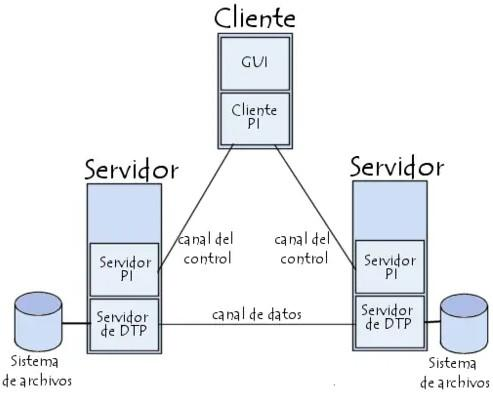

# **4.1 Servidor de Transferencia de Ficheros**

## Introducción

Las aplicaciones de transferencia de ficheros fueron una de las primeras herramientas al desarrollarse en la expansión de las redes de internet. La necesidad de poder acceder a diferentes sistemas e intercambiar información originó uno de los sistemas que actualmente se usan.

Actualmente hay diferentes formas de intercambio de información de forma distribuida en formato fichero:

- Sistemas de ficheros en redes
- Software de mensajería
- Software de distribuciones de ficheros P2P (peer-to-peer)

El FTP (File transfer protocol) o protocolo de transferencia de ficheros es un protocolo que proporciona el servicio de transferencia de ficheros entre sistemas de diferente naturaleza, es decir, se podrán interconectar clientes de Linux hacia un sistema de Microsoft u otros.

## Funcionalidad del servicio de transferencia de ficheros
La funcionalidad que aporta este servicio es esencial en numerosos escenarios y aplicaciones, y desempeña un papel crucial en la gestión y compartición de datos. Estas son algunas de las principales funcionalidades del servicio de transferencia de archivos:

- Transferencia de Archivos
- Copia de Seguridad
- Compartición de Archivos
- Despliegue de Software de actualizaciones y parches.
- Acceso Remoto
- Intercambio de Datos entre Aplicaciones
- Automatización de tareas 
- Seguridad, como el cifrado de datos (a través de protocolos como SFTP o FTPS) y la autenticación
- Control de Acceso
- Monitorización y Registro

En resumen, la funcionalidad del servicio de transferencia de archivos es facilitar la transferencia segura y eficiente de datos entre sistemas y dispositivos. Estas capacidades son fundamentales en numerosos escenarios, desde la gestión de archivos personales hasta la administración de sistemas empresariales y la colaboración en equipo.

## Un poco de historia 
La implementación de la FTP se remonta en el año 1971, cuando se desarrolló un sistema de transferencia de ficheros, definido dentro de la RFC (request for comments) 141, entre equipos del Instituto Tecnológico de Massachusetts (MIT, Massachusetts Institute of Technology). Durante los años posteriores se hicieron diferentes innovaciones al protocolo básico, que se incluyeron en 1973.

El protocolo FTP, tal como se conoce actualmente como estándar, se especifica dentro de la RFC 959 en 1985 y define el funcionamiento del protocolo. Posteriormente, el protocolo FTP se ha ido revisando con algunas nuevas características, pero su base de funcionamiento ha sido mantenida.

## El modelo FTP. ¿Cómo funciona?

El protocolo FTP emplea una arquitectura cliente/servidor, siendo el cliente FTP quien solicita la transferencia de archivos y el servidor FTP quien ofrece los archivos. Pertenece a la familia de protocolos de red TCP y por lo tanto es un protocolo orientado a conexión, esto es, el cliente ftp necesita establecer una conexión con el servidor para empezar la transferencia de ficheros. Si no se establece la conexión ésta no tiene lugar.

Puesto que FTP es un protocolo que no utiliza una autenticación de usuarios y contraseña cifrada, se considera un protocolo inseguro y no se debería utilizar a menos que sea absolutamente necesario. Verás que existen otras alternativas al FTP, como por ejemplo el protocolo FTPS, para mantener comunicaciones cifradas. Aún así, el protocolo FTP está muy extendido en Internet ya que a menudo los usuarios necesitan transferir archivos entre máquinas sin importar la seguridad.

## Canales o puertos de comunicación

El protocolo FTP requiere de dos puertos TCP en el servidor para su funcionamiento, a diferencia de la mayoría de los protocolos utilizados en Internet que solamente requieren un puerto en el servidor. 

Estos dos puertos o canales de comunicación dentro del protocolo FTP son:

- El **canal de control** envía todas las órdenes de comunicación, como pueden ser iniciar la sesión de trabajo y órdenes de ejecución como leer, escribir, listar, borrar, etc.
- El **canal de datos** envía el contenido de aquellos ficheros a trabajar, que puede ser tanto para leer el contenido del fichero como para hacer la escritura del fichero.

Los puertos TCP del servidor en cuestión, suelen ser un __puerto para el control de la conexión__ y otro __puerto para los datos__, a determinar según el modo de conexión, que podría ser el 20 o incluso uno mayor de 1024. Normalmente se utilizan el **puerto 21** como puerto de control o comandos y el **puerto 20** como puerto de datos. 
Hay que tener en cuenta que estos puertos pueden ser modificados en la configuración del servidor, así no es obligatorio que los puertos 21 y 20 sean los asignados al servidor FTP, pero sí son los que éste maneja por defecto. 

## Procesos DTP y PI en el Servidor y en el Cliente

Tanto el cliente como el servidor gestionan dos procesos:

- **Proceso DTP (Data Transfer Protocol, o proceso de transferencia de datos):** es el encargado de establecer la conexión y administrar el canal de datos. Tanto el cliente como el servidor tienen su propio DTP.
- **Proceso PI (Protocol Interpret, intérprete del protocolo):** interpreta el protocolo y permite que el DTP pueda ser controlado mediante órdenes recibidas a través del canal de control.

**El proceso PI en el servidor:**

- Escucha las órdenes que provienen del proceso PI del usuario mediante el canal de control por un puerto de datos (puerto 20).
- Establece la conexión del canal de control.
- Recibe las órdenes FTP del proceso PI del usuario, las responde y ejecuta el proceso DTP del servidor.

**El proceso PI en el cliente:**

- Es el responsable de establecer la conexión con el servidor FTP.
- Envía órdenes FTP.
- Recibe las respuestas del servidor PI.
- Controla el DTP del usuario.

> *El modo de funcionamiento es el siguiente; Cuando un cliente conecta al servidor FTP, la PI del usuario inicia la conexión con el servidor con el protocolo  Telnet (RFC 854). El cliente envía órdenes FTP al servidor, el servidor las interpreta, ejecuta el DTP y responde con un formato estándar. Una vez establecida la conexión, el proceso PI del servidor proporciona el puerto por el cual se enviarán los datos al DTP del cliente, por donde escuchará y recibirá los datos del servidor.*

Toda la comunicación que se hace en el canal de control sigue las recomendaciones del protocolo Telnet.  Los canales de control deben permanecer abiertos durante la transferencia de datos. De este modo, un servidor puede detener una transmisión si el canal de control es interrumpido durante la transmisión.

## Modos de conexión del cliente FTP

Dentro del protocolo FTP se definen dos modos de conexión que se configuran dentro del servicio. Estos modos se refieren a la forma en que se establecen las conexiones de datos entre el cliente y el servidor. 

El modo ftp Activo (o Estándar, o PORT, debido a que el cliente envía comandos tipo PORT al servidor por el canal de control al establecer la conexión) y el modo ftp Pasivo (o PASV, porque en este caso envía comandos tipo PASV). Tanto en el modo Activo como en el modo Pasivo, el cliente establece una conexión con el servidor mediante el puerto 21, que establece el canal de control.

Aquí hay una explicación de las diferencias entre ambos modos:

### Modo FTP activo

Para establecer una conexión FTP activa, se siguen estos pasos:

- En el modo FTP activo, el cliente conecta desde un puerto aleatorio más grande de 1024 (denominemos N) hacia el puerto 21 de control del servidor. 
- El cliente inicia la escucha en el puerto (N+1).
- El servidor establece la conexión desde el puerto 20 al cliente por el puerto de datos especificado por parte del cliente, que es el puerto N+1.

Cuando se trabaja en modo activo puede haber problemas con el cortafuegos del sistema. El cortafuego tiene que tener los puertos abiertos de trabajo del servidor y del cliente, para poder establecer las comunicaciones, ya que es el cliente el que inicia la comunicación en el canal de control, pero es el cliente el que inicial la comunicación en el canal de datos.

Veámoslo con un ejemplo:

Puertos que se abrirán en modo activo dentro del servidor:

1. El cliente conectará al puerto 21 del servidor FTP con un puerto más grande de 1024 del cliente. (Iniciación de la conexión del cliente)
2. El puerto 21 del servidor FTP conectará a un puerto más grande de 1024. (El servidor responde al puerto de control del cliente)
3. El puerto 20 del servidor FTP conectará a un puerto más grande de 1024. (El servidor inicia la conexión de datos hacia el puerto de datos del cliente FTP)
4. El cliente conectará con un puerto más grande de 1024 hacia el puerto 20 del servidor FTP. (El cliente envía la confirmación de conexión al puerto de datos del servidor FTP.)

_En resumen, en modo Activo, el servidor siempre crea el canal de datos en su puerto 20, mientras que en el lado del cliente el canal de datos se asocia a un puerto aleatorio mayor que el 1024. Para ello, el cliente manda un comando PORT al servidor por el canal de control indicándole ese número de puerto, de manera que el servidor pueda abrirle una conexión de datos por donde se transferirán los archivos y los listados, en el puerto especificado._

Ver un ejemplo de [modo activo]([http://example.com/ "Title"](https://upload.wikimedia.org/wikipedia/commons/9/90/Activo.svg
)

### Modo FTP pasivo

Para evitar que el servidor inicie la conexión al cliente, lo que impediría la comunicación si hay un cortafuegos, hay otro método de conexión denominado pasivo.

En el método FTP pasivo el cliente inicia las dos conexiones al servidor (control y datos), resolviendo el problema de control del cortafuego o configuraciones NAT en el filtraje del puerto de datos del servidor hacia el cliente. En caso de no existir cortafuegos no habría problema, pero si existe, al intentar el servidor devolver la respuesta a un puerto diferente, el cortafuegos bloquearía la conexión. Como contrapartida hay que tener más rango de puertos abiertos en el servidor.

- El cliente, al iniciar la conexión FTP, coge un puerto aleatorio más grande de 1024, que llamaremos N y el siguiente como N + 1.
- El primer puerto N hace la conexión hacia el puerto 21 del servidor y evita hacer la conexión al puerto de datos 20. El cliente hará uso de una orden PASV. 
- El servidor abre un puerto aleatorio P más grande de 1024 y le devuelve al cliente con la orden PASV. 
- El cliente inicia el canal de datos del puerto (N + 1) al puerto P.

  Ver un ejemplo de [modo pasivo]([[http://example.com/ "Title"](https://upload.wikimedia.org/wikipedia/commons/6/65/Pasivo.svg)

Veámoslo con un ejemplo:

Para controlar el cortafuego en el servidor FTP en modo pasivo abriremos los puertos siguientes:

1. El cliente conectará al puerto 21 del servidor FTP con un puerto más grande de 1024 del cliente pidiendo una conexión pasiva con la orden PASV. (Iniciación de la conexión del cliente)
2. El puerto 21 del servidor FTP conectará a un puerto más grande de 1024 del cliente. (El servidor responde al puerto de control del cliente).
3. Un puerto más grande de 1024 del cliente conectará a un puerto más grande de 1024 del servidor. (El cliente inicia el canal de datos a un puerto aleatorio del servidor).
4. Un puerto más grande de 1024 del servidor conectará a un puerto más grande de 1024 del cliente. (El servidor confirma la conexión al puerto de datos)

_En la figura, al paso 1 el cliente contacta con el servidor por el puerto 21 pidiendo una conexión pasiva con la orden PASV. El servidor responde en el paso 2 con un puerto aleatorio, en el ejemplo 1024, pidiendo al cliente qué puerto es el que usará para abrir el canal de datos. En el paso 3 el cliente inicia el canal de datos del puerto de datos del cliente 1027 al puerto que ha abierto el servidor 1024. En el paso 4 el servidor confirma la conexión._

**Con el modo pasivo se resuelven muchos problemas del cliente, pero se amplían los problemas del servidor. Uno de los principales problemas es la apertura de un gran rango de puertos en el servidor para poder iniciar canales de datos.**

Una de las ventajas actualmente es que las implementaciones de servidores FTP permiten escoger el rango de puertos que se usarán.

