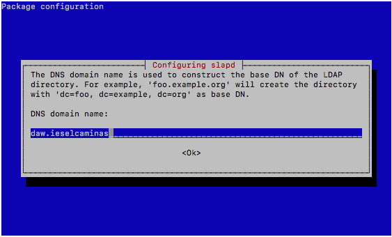
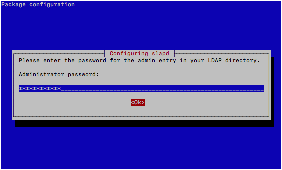
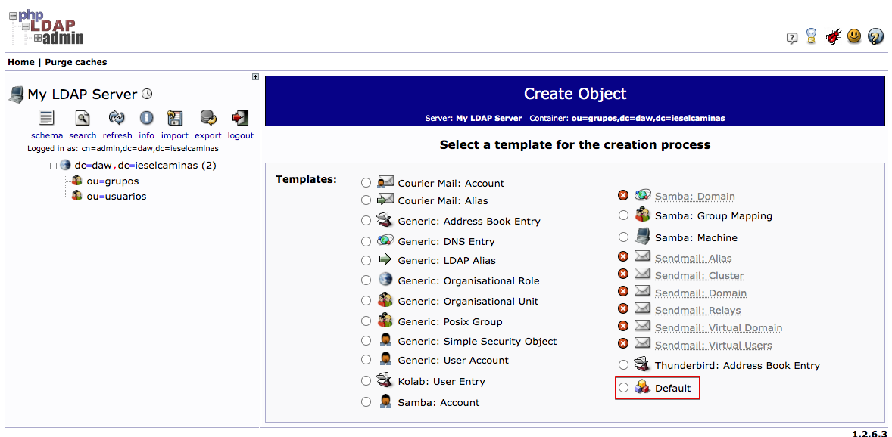
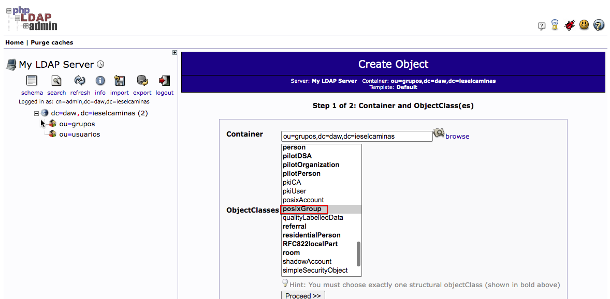

# Práctica 5.2 - Configuración de un servidor LDAP y autenticación en Apache

## Creación de la máquina virtual

Para empezar, entra en AWS Academy y crea un nuevo EC2 Debian con estas características. 

* Llámale P5ServidorLDAP.
* Dale los recursos que te ofrece por defecto.
* Crea un Grupo de seguridad con el nombre P5ServidorLDAP y abre los puertos necesarios para que una máquina externa pueda consultarlo.
* Arranca la máquina y actualízala para que cuente con las últimas versiones de todos los paquetes.

## Servidor LDAP

Un servidor LDAP es un servidor de datos optimizado para la realización rápida de consultas de lectura y orientado al
almacenamiento de datos de usuarios a modo de directorio.

La principal utilidad de un directorio LDAP es como servidor de autentificación para los distintos servicios de un sistema
informático como puedan ser: autentificación para entrar en un PC, para entrar en una aplicación web, para acceder a un
servidor ftp, para acceder a servidores de correo entrante POP3 y saliente SMTP, etc...


Si en nuestra red disponemos de un servidor LDAP y configuramos todos los PCs y todos los servicios de la red para que se
autentifiquen en él, bastará con crear las cuentas de usuario y grupos de usuarios en nuestro servidor LDAP para que los
usuarios puedan hacer uso del sistema y de sus servicios desde cualquier puesto de la red. Es un sistema ideal para
centralizar la administración de usuarios en un único lugar.

## Instalación y configuración de OpenLDAP

Para simplificar la administración de los usuarios del sistema es ideal utilizar una base de datos accesible mediante LDAP.
Almacenar las cuentas de usuario de forma centralizada en un único repositorio facilitará la creación, modificación y
eliminación de cuentas de usuario y grupos de usuarios. Será necesario configurar los PCs de la red para que utilicen el
servidor LDAP como servidor de autentificación.

El servidor OpenLDAP está disponible en el paquete slapd por tanto, lo instalaremos utilizando apt-get. También nos
conviene instalar el paquete ldap-utils que contiene utilidades adicionales:

```sh
sudo apt-get install slapd ldap-utils
```

Nos preguntará la password de administrador del servidor. Le pondremos "ieselcaminas"


Ahora comprobaremos si el servicio está en marcha con el comando habitual y recordando que el servicio se llama `slapd`.

Vamos a ver qué información tiene ahora mismo la base de datos con el comando `slapcat`

```sh
$sudo slapcat
dn: dc=nodomain
objectClass: top
objectClass: dcObject
objectClass: organization
o: nodomain
dc: nodomain
structuralObjectClass: organization
entryUUID: 3d387392-2972-103e-985d-2d8a79039ae4
creatorsName: cn=admin,dc=nodomain
createTimestamp: 20231207173146Z
entryCSN: 20231207173146.118049Z#000000#000#000000
modifiersName: cn=admin,dc=nodomain
modifyTimestamp: 20231207173146Z
```

Como vemos solo está creado el nodo raíz y con dc=nodomain.

Vamos a configurar nuestro directorio con el nodo raíz `dc=daw,dc=ieselcaminas` siguiendo estos pasos

```sh
sudo dpkg-reconfigure slapd
```








Ejecutamos nuevamente slapcat para ver las modificaciones:

```sh
sudo slapcat
dn: dc=daw,dc=ieselcaminas
objectClass: top
objectClass: dcObject
objectClass: organization
o: daw.ieselcaminas
dc: daw
structuralObjectClass: organization
entryUUID: 02508bf0-297e-103e-94fc-6953981852de
creatorsName: cn=admin,dc=daw,dc=ieselcaminas
createTimestamp: 20231207185601Z
entryCSN: 20231207185601.251149Z#000000#000#000000
modifiersName: cn=admin,dc=daw,dc=ieselcaminas
modifyTimestamp: 20231207185601Z
```

Ya tenemos nuestro directorio iniciado con el nodo raíz que queríamos. La configuración de ldap con ficheros es compleja (puedes encontrar cómo hacerlo en las referencias), así que vamos a hacer uso de una herramienta web "phpldapadmin". La instalaremos con:

```sh
sudo apt-get install phpldapadmin
```

Y desde el navegador web de nuestro PC accederemos con la URL: "http://IPSERVER/phpldapadmin". Si todo va bien tendremos algo similar a esto:


Si pinchamos sobre login nos pedirá los datos de acceso. Si recordamos la salida de slapd nuestro usuario no es el que nos ofrece, sino `cn=admin,dc=daw,dc=ieselcaminas`. Recuerda que la password que pusimos fue `ieselcaminas`.


Comprobamos como el login es correcto, pero el DIT o Directory Information Tree no es el correcto. El dn del nodo raíz en nuestro caso debería ser dc=daw,dc=ieselcaminas, pero phpldapadmin, por defecto, intenta mostrar un DIT cuyo nodo principal es "dc=example,dc=com". 


Vamos a solucionarlo editando el fichero de configuración de phpldapadmin, `/etc/phpldapadmin/config.php`.

```sh
sudo nano /etc/phpldapadmin/config.php
```

Busca y sustituye las únicas 2 líneas donde aparece `dc=example,dc=com` y sustituyelo por `dc=daw,dc=ieselcaminas`. Lo encontrarás en más líneas, pero fíjate que en el resto la línea está comentada. Las 2 líneas a sustituir son:

```sh
$servers->;setValue('server','base',array('dc=example,dc=com'));
$servers->setValue('login','bind_id','cn=admin,dc=example,dc=com');
```

Que quedarán así:

```sh
$servers->setValue('server','base',array('dc=daw,dc=ieselcaminas'));
$servers->setValue('login','bind_id','cn=admin,dc=daw,dc=ieselcaminas');
```

Refresca tu navegador y ahora ya deberías ver el DIT correcto.


Pincha sobre `dc=daw,dc=ieselcaminas`. La primera vez te saldrán muchos mensajes, no te preocupes. Vuelve a pincharle.

Vamos a crear 2 unidades organizativas, una para grupos y otra para usuarios. Seleccionamos "Create a child entry"


El siguiente paso no necesita captura de pantalla. Completalo y comprueba que la ou=grupos se ha creado correctamente.

Crea tu mismo la ou=usuarios y comprueba ambas ou.


Ahora vamos a crear los grupos. Comprueba primero que el gid que vas asignar a tus grupos no existe en `/etc/group`. El 10000 puede ser una buena opción para profesores y el 10001 para alumnos.

Para crear el grupo de profesores selecciona la ou=grupos y elige "Create a child entry". Selecciona "Default".



Ahora elige posixGroup.




Completa como en el ejemplo:


Completa el asistente y comprueba que se ha creado el grupo. Ahora crea un nuevo grupo para los alumnos con gid=10001 y comprueba que tienes ambos creados.


Ahora podemos pasar a crear los usuarios. Vamos primero a crear un "profe01" que pertenezca al grupo profesores.

Selecciona la ou=usuarios. Pincha sobre "Create a child entry" y elige "Default" como antes. Ahora elige **account** y **posixAccount** (matén CTRL apretado para seleccionar ambos). 


Tras hacer clic sobre "commit" ya tendremos creado nuestro usuario.

Crea un par de usuarios más. Por ejemplo un `alu01` y `alu02`.


## Autenticación Apache contra LDAP

Ya hemos instalado nuestro servidor OpenLDAP y hemos aprendido a crear usuarios. La utilidad real de esos usuarios será usarlos para validarse al acceder a algún sistema. Uno de los usos más habituales es para acceder al sistema operativo en distintos ordenadores. Pero como nosotros estamos en despliegue de aplicaciones web vamos a usarlo para acceder a una zona de un servidor web Apache. El motivo de usar Apache es que ya se instaló al instalar phpldapadmin y que la autenticación es muy sencilla de configurar.

En primer lugar comprobaremos que el servicio `apache2` está funcionando.

Habilita el módulo de autenticación LDAP Apache2.

```sh
sudo a2enmod authnz_ldap
```

Vamos a solicitar la autenticación a los usuarios que intentan acceder a un directorio denominado `test`.

Crea un directorio denominado `test` y crea dentro un archivo index.html. Cambia el usuario y grupo del directorio `test` y su contenido a www-data.

```sh
sudo mkdir /var/www/html/test
sudo cp /var/www/html/index.html /var/www/html/test/
sudo chown -R www-data:www-data /var/www/html/test 
```

Ahora vamos a editar el archivo de configuración Apache 000-default.conf.

```sh
sudo nano /etc/apache2/sites-enabled/000-default.conf
```
Incluímos las líneas resaltadas:

```yaml hl_lines="7-17"
<VirtualHost *:80>
        ServerAdmin webmaster@localhost
        DocumentRoot /var/www/html
        ErrorLog ${APACHE_LOG_DIR}/error.log
        CustomLog ${APACHE_LOG_DIR}/access.log combined

        <Directory "/var/www/html/test"> #(1)
        Options Indexes FollowSymlinks
        AuthType Basic
        AuthName "Apache LDAP authentication"
        AuthBasicAuthoritative Off
        AuthBasicProvider ldap 
        AuthLDAPURL "ldap://127.0.0.1/ou=usuarios,dc=daw,dc=ieselcaminas?uid?su> #(2)
        AuthLDAPBindDN "cn=admin,dc=daw,dc=ieselcaminas" #(3)
        AuthLDAPBindPassword ieselcaminas #(4)
        Require valid-user
        </Directory>

</VirtualHost>
```

1. El directorio al que vamos a pedir autenticación para acceder
2. El servidor ldap y la ruta donde buscar los usuarios. Lo veremos en detalle
3. El usuario con el que conectarse al servidor ldap. El mismo que usamos en phpldapadmin
4. La contraseña de ese usuario

La directiva AuthLDAPURL es la que tendréis que cambiar según la situación:

```
AuthLDAPURL ldap://host:port/basedn?attribute?scope?filter [NONE|SSL|TLS|STARTTLS]
```
Si desmenuzamos la sintaxis:

* host y port son evidentes

* basedn es la ruta LDAP donde buscar los usuarios

* attribute, define el nombre atributo que contiene el nombre del usuario (normalmente uid)

* scope, puede ser one (para buscar en un subnivel a partir del basedn) o sub (para buscar en todos los subniveles)

* filter, filtro opcional de búsqueda, por ejemplo: (&(objectClass=inetOrgPerson)(description=*#*test*))

* [NONE|SSL|TLS|STARTTLS], parámetro opcional definiendo el tipo de conexión, por defecto NONE.

Recuerda reiniciar `apache2` para que se apliquen los cambios.

Ahora ya solo nos queda probar el funcionamiento. Abre una ventana privada de navegador en tu ordenador. Deberás abrir una ventana privada para cada prueba.

Accede a `http://IPSERVER/test`.

Te debería pedir un usuario y contraseña. Prueba con `profe01` y la contraseña que le pusiste antes. Luego abre una ventana privada y prueba con una contraseña incorrecta.

## Recursos.

[Sistemas Operativos en Red](http://somebooks.es/sistemas-operativos-en-red/) - Capítulo 11. Instalar y configurar OpenLDAP

[Apache - Autenticación LDAP en Active Directory
](https://techexpert.tips/es/apache-es/apache-autenticacion-ldap-en-active-directory/)

[Apache 2.2 autenticación básica contra un LDAP
](https://juancarlosmolinos.net/servidores-web-aplicaciones/apache/apache-2-2-autenticacion-basica-contra-un-ldap/)
