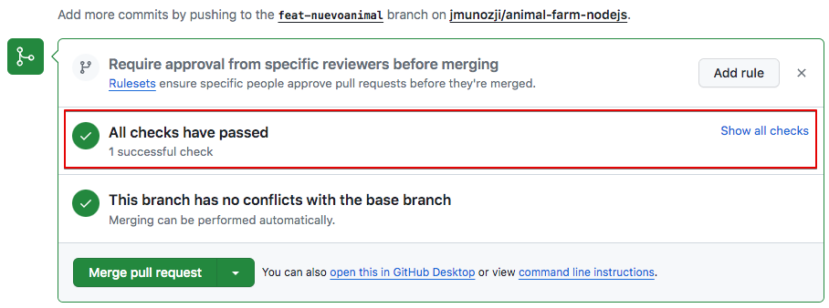

# Práctica 8.1- Toma de contacto con CI/CD usando Github actions

## Introducción

### ¿Qué es Github actions?

GitHub Actions es una plataforma de integración y despliegue continuos (CI/CD) que te permite automatizar tu proceso de compilación, pruebas y despliegue. Puedes crear flujos de trabajo (*workflows*) y crear y probar cada solicitud de cambios en tu repositorio o desplegar solicitudes de cambios fusionadas a producción. Todo se hace desde tu cuenta GitHub, así que no has de hacer nada adicional para usarla.

GitHub Actions va más allá de solo DevOps y te permite ejecutar flujos de trabajo cuando otros eventos suceden en tu repositorio. Por ejemplo, puedes ejecutar un flujo de trabajo para que agregue automáticamente las etiquetas adecuadas cada vez que alguien cree una propuesta nueva en tu repositorio.

GitHub proporciona máquinas virtuales Linux, Windows y macOS para que ejecutes tus flujos de trabajo o puedes hospedar tus propios ejecutores auto-hospedados en tu propio centro de datos o infraestructura en la nube.

Un **workflow** ejecutará uno o más "jobs" que se definen mediante un archivo YAML. Estos archivos se ubican en el directorio `.github/workflows` de un repositorio y puede haber varios archivos de workflow para diferentes cometidos.

Un **evento** es una actividad que dispara un flujo de trabajo o workflow. Estos eventos pueden ser un *push*, un *pull request* o un *merge*.

Por último, los **jobs** son acciones o pasos que se ejecutan dentro de un workflow.

Una **acción** es una aplicación personalizada para la plataforma de GitHub Actions que realiza una tarea compleja pero que se repite frecuentemente.

Para entender detalladamente todos los componentes, podéis consultar [aquí](https://docs.github.com/es/actions/learn-github-actions/understanding-github-actions). Para entender bien el resto de la práctica te recomiendo su lectura.

## Acciones previas

!!!warning "Atención"
    Antes de comenzar esta práctica, debéis tener una cuenta en Docker Hub: [https://hub.docker.com/](https://hub.docker.com/) y en GitHub [https://github.com/](https://github.com/).

En esta práctica vamos a unir muchas cosas que hemos aprendido en este curso y nos servirá de recopilatorio del curso. Así que te guiaré en puntos específicos de la misma, pero en otros te indicaré lo que has de hacer y deberás hacerlo por ti mismo. Puedes consultar prácticas pasadas si no sabes cómo hacer alguna cosa.

Vamos a trabajar en AWS sobre una máquina virtual EC2 Debian con las opciones por defecto. 

Vamos a utilizar una aplicación simple en NodeJS, que correrá en un servidor Express. Por tanto, necesitamos tener instalados en nuestro sistema Node.js y Yarn.

Así pues, las primeras acciones a realizar serán:

* En AWS crea una máquina virtual Debian con las opciones por defecto. Llámale "AnimalFarm" y a su grupo de seguridad ponle el mismo nombre.
* Actualiza los paquetes a la última versión.
* Instala Git y configúralo con tus datos, incluyendo el login para que pueda conectar con tu cuenta GitHub mediante clave ssh.
* Instala Docker y configúralo para que pueda hacer "push" de tus contenedores a tu cuenta DockerHub.
* Instala Node.js 
* Instala Yarn.

!!!tip "Instalación de Yarn"
    Yarn es un gestor de paquetes de JavaScript y en Debian se puede instalar mediante npm, apt o script. 
    [Aquí](https://kifarunix.com/install-yarn-on-debian-11/) se explican los 3 métodos de instalación, elegid el que más os guste.


## Comenzamos

Como hemos comentado vamos a trabajar con una aplicación simple en NodeJS que se llama "Animal Farm", que correrá en un servidor Express.

El objetivo de esta práctica será utilizar GitHub Actions para añadir ciertas automatizaciones iniciales a nuestro repositorio. Haremos que se *disparen* pruebas sobre nuestro código cuando se abra un *pull request* y, automáticamente, construiremos una imagen Docker para nuestra aplicación. Además, podremos hacer que dicha imagen *docker* se envíe automáticamente a DockerHub y a GitHub Container Registry, completando así el ciclo completo de integración y despliegue contínuo.

La aplicación que usaremos está [aquí](https://github.com/jamtur01/animal-farm-nodejs). Empieza por hacer un fork de dicho repositorio en tu cuenta GitHub.

!!!Nota
    Por si el propietario del repositorio lo borrara, puedes encontrar copia de los ficheros que contiene [aquí](P8_1/animal-farm-nodejs-main.zip). Puedes generar tu propio repositorio a partir de estos ficheros.


Ahora clona tu repositorio en local y echa un ojo a lo que tiene:

```console
$ git clone git@github.com:jmunozji/animal-farm-nodejs.git
$ cd animal-farm-nodejs
```

En el paquete encontraremos lo siguiente:

* app.js - Es la aplicación que estamos desplegando
* test/test.js - Es el código que testeará si la aplicación app.js es correcta
* .github/workflows - Son los flujos que haremos que GitHub ejecute para testear la aplicación y desplegar los contenedores

Iremos viendo todo poco a poco.

Utilizamos ahora **yarn** para instalar los módulos requeridos de Node.js

```console
$ yarn install
```

Y utilizamos yarn una vez más para iniciar la aplicación:

```console
$ yarn start
```

Si ahora accedemos a la IP de la máquina virtual, en el puerto 8080, deberíamos tener acceso al sitio web y ver la ejecución de la aplicación:


Si actualizáis varias veces, podréis ver qué otros animales hay en la granja. 

Para la ejecución y vamos a probar las pruebas. Tenemos una batería de pruebas, no muy exhaustiva, en el directorio `test`. Probemos a ejecutarlos con yarn:


Llegados a este punto hemos probado la ejecución del programa y hemos realizado la batería de tests que comprueban que el código es correcto.

## Creando nuestro primer workflow

Todos los repositorios de GitHub vienen con *Actions* activado por defecto. Comprobad en vuestro repositorio que existe una pestaña llamada **Actions**. Los habilitaremos.


Lo que necesitáis hacer es, en los *settings* de vuestro repositorio buscar el apartado de *Actions* y darle permisos para realizar cualquier acción si no está ya activada. Podéis consultar el procedimiento en detalle [aquí](https://docs.github.com/es/repositories/managing-your-repositorys-settings-and-features/enabling-features-for-your-repository/managing-github-actions-settings-for-a-repository)

Como ya hemos dicho, Actions ejecuta los workflows, los cuales suelen estar asociados a fases específicas del ciclo de desarrollo. Por ejemplo, un workflow que corra cuando se abra un "pull request". También hemos comentado que dentro de los workflows están los jobs, que son acciones individuales dentro de un workflow. Por ejemplo:

```
Workflow 1
    1. Clona el repositorio
    2. Instala los prerrequisitos
    3. Ejecuta los tests
```

En la [introducción](#¿qué-es-github-actions) también se ha explicado dónde y cómo se definen estos workflows. El repositorio que hemos clonado ya los tiene definidos, así que vamos a verlos. En el repositorio clonado en nuestra Debian, comprobamos que existe el directorio donde se guardan los "workflows" y entraremos en él:

```console
$ ls .github/workflows
$ cd .github/workflows
```
## Testeando nuestro código con un workflow

Como lo prometido es deuda, vamos a usar un workflow que ejecute nuestras pruebas (archivo ./test/test.js) cuando abramos un nuevo "pull request" en GitHub. Para ello se crea un archivo YAML.  

En el directorio de nuestros workflows ya hay un archivo llamado `test`, que definirá nuestras pruebas:

```console
ls test.yml
```

!!!note "Nota"
    El formato YAML puede llegar a ser bastante puñetero hasta que sea correcto. Podéis comprobar si vuestro archivo .yml está correctamente formateado en [este validador online](https://www.yamllint.com/) 

Y el contenido del archivo es el siguiente:

```yaml
name: Animal Farm Node.js CI  #(1)

on: #(2)
  push:
   branches:
      - main
  pull_request:
    branches:
      - main
jobs: #(3)
  build:
    runs-on: ubuntu-latest #(4)
    steps: #(5)
    - name: Checkout repository # (6)
      uses: actions/checkout@v2 #(7)
    - name: Use Node.js
      uses: actions/setup-node@v1 #(8)
      with:
        node-version: '18.x'
    - name: Run Yarn #(9)
      run: yarn
    - name: Run tests
      run: yarn test

```

1. Nombre descriptivo para nuestro workflow
2. En este bloque *on* definimos cuándo va a ejecutarse nuestro workflow:
     + Cuando alguien haga push sobre la rama **main**
     + Cuando alguien abra un pull request desde la rama **main**

3. Aquí se definen los jobs, en nuestro caso uno solo: `build`. 
4. Cada job corre en una [plataforma esecífica](https://docs.github.com/en/actions/using-workflows/workflow-syntax-for-github-actions#jobsjob_idruns-on), pudiendo elegir entre Linux, Windows o MacOS. En nuestro caso particular vamos a ejecutar nuestro job en un contenedor usando Ubuntu Linux.
5. Las tareas o *pasos* que ejecutará el job. Si un paso falla, por norma general, fallará todo el job.
6. Nombramos cada paso del job
7. Este paso básicamente hace un clonado del repositorio. 
  Hace uso de una acción pre-empaquetada (`actions/checkout@v2`). Este tipo de acciones las suele proporcionar la comunidad de GitHub y, normalmente, ejecutan tareas que de otra forma supondrían múltiples pasos o supondrían una configuración muy repetitiva.
1. Se trata de otra acción pre-empaquetada. Se encarga de intalar Node.js dentro del contenedor que está corriendo o ejecutando nuestro job. Podemos pasarle argumentos, en este caso con el bloque `with` le decimos qué versión de Node.js debe instalar.
2. Estos pasos son el núcleo de nuestro job ya que se encargará de ejecutar yarn para instalar los módulos necesarios de Node.js y, en el último paso, ejecutar los tests con `yarn tests`

### Comprobando nuestro workflow

Vamos a realizar un cambio en nuestra aplicación para después crear un pull request con él.

1. Crea una nueva rama y llámale "feat-nuevoanimal". 
2. Posiciónate en la nueva rama.
3. Edita el filchero `app.js` , añadiendo un nuevo animal junto con su onomatopeya.
4. Ejecuta los tests para ver si el código es correcto.
5. Si los test no te dan OK, revisa y soluciona el motivo. Revisa el fichero test/test.js también.
6. Confirma los cambios y súbe la nueva rama a GitHub.
7. Comprueba en GitHub que se ha creado la nueva rama y que contiene los cambios realizados.

??? Example "Solución"
    1. Creamos una nueva rama y nos posicionamos en ella con el comando:
    ```console
      $ git checkout -b feat-nuevoanimal
    ```
    2. Edita con nano el fichero `app.js` añadiendo un nuevo animal junto con su onomatopeya. Guarda los cambios.
    3. Ejecuta los "test" en local. No te darán bien porque hay que modificar el fichero test/test.js para que tenga en cuenta el nuevo animal introducido. Modifícalo.
    4. Comprueba que los tests en local son correctos antes de continuar. No tendría mucho sentido que el programador suba al repositorio un código que no supera las pruebas localmente, ¿no?
    5. Confirma los cambios y súbelos a GitHub.
      ```
        $ git add app.js
        $ git commit -a -m “Añadido un nuevo animal”
        $ git push origin feat-nuevoanimal
      ```

Ahora crearemos un pull request para esta rama. Recuerda que un "Pull request" es una solicitud para introducir en la rama principal los cambios realizados en una rama.


!!! Warning
    Tened cuidado de hacer el "Pull request" de vuestra rama "feat-nuevoanimal" a vuestra rama "main" en vuestro repositorio y no sobre la rama main del proyecto principal "jamtur01/animal-farm-nodejs".
    
    

Recuerda que nuestro Workflow se ejecutaba en 2 ocasiones:

* Cuando alguien haga push sobre la rama **main**
* Cuando alguien abra un pull request desde la rama **main**

En este caso hemos abierto el pull request. De forma automática se ejecutarán los tests para comprobar que el código que solicitamos incluir en la rama principal supera los tests antes de aceptar o rechazar el pull request. 



En la pestaña de checks podremos comprobar el estado de nuestro workflow.

!!!task "Tarea"
    Comprueba si este workflow se ha completado con éxito (check verde) o no (aspa roja). En caso de no haberlo hecho, modifica el test con lo necesario y súbelo al repositorio para que se pueda completar con éxito. Recuerda, el test está definido en test/test.js 

Cuando el workflow se ejecute correctamente, deberemos ver algo como esto:


   
## Un workflow para construir imágenes de Docker

Nuestro objetivo ahora, puesto que hemos automatizado los tests a nuestro código, es que cuando éstos se completen con éxito, y se acepte el Pull Request haciendo merge con la rama principal, se construya una imagen Docker de nuestra aplicación y automáticamente se suba a los repositorios de Docker Hub y Github Container Registry (el repositorio para imágenes Docker de GitHub). 

En primer lugar, como ya sabemos, revisaremos y modificaremos el archivo para el nuevo workflow:

```console
cd .github/workflows
nano docker.yml
```

Y lo editamos, introduciendo el código yaml necesario:

```yaml
name: Publish Docker image

on:
  push:
    branches:
      - main

jobs:
  build-and-push:
    runs-on: ubuntu-latest
    steps:
      -
        name: Checkout
        uses: actions/checkout@v2
      -
        name: Set up QEMU
        uses: docker/setup-qemu-action@v1
      -
        name: Set up Docker Buildx
        uses: docker/setup-buildx-action@v1
      -
        name: Login to DockerHub
        uses: docker/login-action@v1
        with:
          username: ${{ secrets.DOCKERHUB_USERNAME }}
          password: ${{ secrets.DOCKERHUB_TOKEN }}
      -
        name: Login to GitHub Container Registry
        uses: docker/login-action@v1
        with:
          registry: ghcr.io
          username: ${{ github.repository_owner }}
          password: ${{ secrets.GHRC_TOKEN }}
      -
        name: Build and push
        uses: docker/build-push-action@v2
        with:
          context: .
          file: ./Dockerfile
          push: true
          tags: | #(1)
            jmunozji/animal-farm-nodejs:latest
            ghcr.io/jmunozji/animal-farm-nodejs:latest
```

1. Sustituid `jmunozji` por vuestro nombre de usuario de Docker Hub y Github Container Registry (ghcr) respectivamente

Vamos a analizar el contenido de este fichero:

Hemos llamado a nuestro nuevo workflow *Publish Docker image*. En este caso nuestro bloque `on` sólo se "dispara" o activa cuando se produce un merge en la rama main.

Tenemos un job en nuestro workflow llamado `build-and-push` que se ejecuta en `ubuntu-latest`. Este job hace check out (clonado) usando la action que usamos en nuestro anterior workflow. Tras ello, utiliza unas actions pre-empaquetadas nuevas, con el fin de configurar un entorno para construir imágenes de Docker usando QEMU y Docker buildx.

!!!note "Aclaración"
    [Qemu](https://wiki.archlinux.org/title/QEMU_(Espa%C3%B1ol)) es una aplicación de código abierto que emula diferentes arquitecturas hardware y permite virtualizar.

    [Buildx](https://docs.docker.com/build/) es un plugin de Docker para ampliar las capacidades a la hora de construir imágenes.

Utilizamos otra Action para hacer login en ambos, Docker Hub y Github Container Registry. En los pasos de esta nueva Action vemos un nuevo elemento, las <u>**variables**</u>

```yaml
${{ secrets.DOCKERHUB_USERNAME }}
```

Las Actions pueden usar variables para personalizar los workflows y permitir que introduzcamos datos externos. Estos datos pueden incluir secretos (secrets), como nuestro usuario y password/token de Docker Hub, variables de entorno como nuestro path o valores específicamente definidos por el usuario.

!!!note "Nota"
    Los secretos cifrados permiten almacenar información sensible en un repositorio.

    Los secretos son variables cifradas que creas en una organización, repositorio o entorno de repositorio. Los secretos que creas están disponibles para utilizarse en los flujos de trabajo de GitHub Actions. GitHub garantiza que los secretos se cifren antes de llegar a GitHub y permanezcan cifrados hasta que los use en un flujo de trabajo.

    Más información [aquí](https://docs.github.com/es/actions/security-guides/encrypted-secrets).

Para configurar los secrets de nuestro repositorio, debemos acceder dentro de él a `Settings > Secrets and variables > Actions`:


Y ahí crearemos los secretos para nuestro repositorio con el mismo nombre que aparecen en el archivo del workflow, así como los valores pertinentes para vuestro caso.


Para DockerHub podéis usar el usuario y contraseña o crear un Token para esta práctica. En caso de no tenerlo, podéis crearos un token en Docker Hub en `Account Settings > Security`.


Pero para conectarnos al Github Container Registry (el repositorio para imágenes Docker de GitHub) hemos de generar un Token personal (classic) de GitHub.

Ve a tu usuario, Settings - Developer settings Personal access tokens - Tokens (classic) y selecciona "Generate new token" y asegúrate de darle estos permisos:

  ```
  write:packages    Upload packages to GitHub Package Registry
    read:packages   Download packages from GitHub Package Registry
  delete:packages   Delete packages from GitHub Package Registry
  ```

Copia el token. Ahora ve al repositorio, Settings - Secrets and Variables - Actions. Crea un "New Repository Secret", llámale GHRC_TOKEN y asígnale el token que acabas de crear.

En última instancia, nuestro workflow construye la nueva imagen de Docker usando el Dockerfile disponible en nuestro repositorio y hace *push* de la imagen construida tanto a Docker Hub como a Github Container Registry.

!!!warning "Cuidado"
    No olvidéis hacer otra vez commit y push para subir este workflow al repositorio, de otra forma, al no existir en el repositorio y sólo en vuestra máquina local, no se ejecutará.

En este momento, si ya hemos entendido el fichero y hemos creado los "secrets" en el repositorio, ya podemos hacer que se ejecute el nuevo workout, que recordemos se "dispara" al hacer merge en la rama main.

Así las cosas, hagamos merge de nuestro PR (Pull Request). Vamos a aceptar el "Pull request" con la opción "Merge pull request" y "Confirm merge". Esto activará nuestros dos workflows, el primero que correrá una vez más los tests para confirmar que la nueva rama main está funcionando correctamente y el segundo que construirá la imagen Docker y hará el push a los repositorios de imágenes.


Si todo se ha hecho bien, funcionará correctamente.

Merge del pull request:


Resultado de los workflows:


Ahora podemos comprobar que el contenedor se ha creado y subido tanto a DockerHub como a Github Container Registry.

En DockerHub:

1. Comprobad, entrando via web, que la imagen Docker que acabáis de construir está disponible en vuestro repositorio personal.

2. Comprobad que podéis descargarla y correr el contenedor asociado sin problemas:

  ```console
  docker run -d -p 9000:8080 jmunozji/animal-farm-nodejs
  ```
3. Comprueba que el contenedor está funcionando correctamente accediendo a la aplicación en `http://IP_Maq_Virtual:9000` (hemos hecho corresponder el puerto 8080 del contenedor con el 9000 del anfitrión)

En GitHub Container Registry

1. Ve a Packages y comprueba que el contenedor está ahí. Quizás tengas que borrar los filtros para verlo.
2. Desde la consola conéctate al repositorio de contenedores GitHub Container Regystry
  ```console
  $ export CR_PAT=TUPERSONALACCESSTOKEN
  $admin@ip-172-31-84-190:~$ echo $CR_PAT | docker login ghcr.io -u TUUSUARIOGITHUB --password-stdin
  WARNING! Your password will be stored unencrypted in /home/admin/.docker/config.json.
  Configure a credential helper to remove this warning. See
  https://docs.docker.com/engine/reference/commandline/login/#credentials-store
  Login Succeeded
  ```
  Cambia TUPERSONALACCESSTOKEN y TUUSUARIOGITHUB por tus valores personales. Ojo, este token no es el mismo que usamos antes. Deberás crear un token para este cometido con los permisos adecuados.
3. Crea y lanza el contenedor con
   ```console
   $ docker run -d -p 9000:8080 ghcr.io/jmunozji/animal-farm-nodejs
   ```
4. Comprueba que el contenedor está funcionando correctamente accediendo a la aplicación en `http://IP_Maq_Virtual:9000` (hemos hecho corresponder el puerto 8080 del contenedor con el 9000 del anfitrión)


Y esto es sólo una pequeñísima muestra de todo lo que se puede hacer con GitHub Actions. Probablemente no has captado toda la potencia al hacer la práctica poco a poco. Ahora que todo está preparado y funcionando prueba a hacer lo siguiente:

1. Borra la rama feat-nuevoanimal
2. Crea una nueva rama y posiciónate en ella.
3. Crea un nuevo animal con su onomatopeya. Modifica el test adecuadamente
4. Confirma cambios y haz un push de la nueva rama
5. Crea un pull request.
6. Comprueba cómo se ejecutan los test en GitHub. Si hay algún problema solucionalo.
7. Haz el merge con la rama principal
8. Comprueba cómo automáticamente se crean las imágenes docker en DockerHub y GHRC.


## Referencias

[Build a CI/CD workflow with Github Actions ](https://github.com/readme/guides/sothebys-github-actions)

