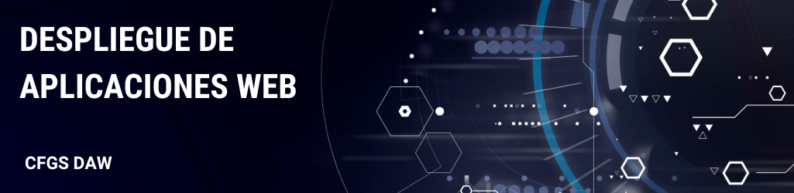

## Índice

Apuntes y prácticas del módulo **Despliegue de aplicaciones web** de <u>2º de DAW</u>

* 0 - Introducción
* 1 - Control de versiones
* 2 - Contenedores
* 3 - Arquitectura web - Implantación y admnistración de servidores web
* 4 - Servicios de red implicados en el despliegue de aplicaciones web - DNS y LDAP
* 5 - Servicios de red implicados en el despliegue de aplicaciones web - FTP
* 6 - Servidores de aplicaciones
* 7 - CI/CD (Integración y despliegue continuo)

## Tabla de versiones

| version | Autor                                                                | Comentarios                                                                                                    |
| ------- | -------------------------------------------------------------------- | -------------------------------------------------------------------------------------------------------------- |
| 0.0     | [Raúl Riesco Montes](mailto:r.riesco@edu.gva.es)                            | Versión original de estos apuntes del compañero Raúl Riesco, del IES Severo Ochoa de Elche |
| Curso23/24    | [José Muñoz Jimeno](https://about.me/jmunozj){:target="_blank"} y Noelia Beltrán Mañas | Adaptación de los materiales a nueva normativa y necesidades del IES El Caminàs.                               |
| Curso24/25   | [José Muñoz Jimeno](https://about.me/jmunozj){:target="_blank"} | Modificación de los materiales para el nuevo curso escolar.   |
| Curso25/26   | [Pedro Segarra Cabedo](mailto:p.segarracabedo@edu.gva.esj){:target="_blank"} | Adaptación del curso con la incorporación de la dual-empresa y cambio de horas de docencia.|                             

## Marco normativo
El presente módulo profesional se enmarca en el 2º curso del título de Técnico Superior en Desarrollo de Aplicaciones Web. Dicho título viene regulado por:

- [Real Decreto 686/2010, de 20 de mayo, por el que se establece el título de Técnico Superior en Desarrollo de Aplicaciones Web y se fijan sus enseñanzas mínimas.](https://www.boe.es/eli/es/rd/2010/05/20/686){:target="_blank"}
- [Real Decreto 405/2023, de 29 de mayo, por el que se actualizan los títulos de la formación profesional del sistema educativo de Técnico Superior en Desarrollo de Aplicaciones Multiplataforma y Técnico Superior en Desarrollo de Aplicaciones Web, de la familia profesional Informática y Comunicaciones, y se fijan sus enseñanzas mínimas.](https://www.boe.es/eli/es/rd/2023/05/29/405){:target="_blank"}, que modifica el RD 686/2010 en sus artículos 2, 5, 6, 8, 9 y el anexo I, donde se describen los "Resultados de aprendizaje y criterios de evaluación" así como los "Contenidos básicos" y "Orientaciones pedagógicas" de los distintos módulos profesionales que conforman el título.
 
El currículo del módulo viene definido, a nivel autonómico por la siguiente normativa:

- [ORDEN 60/2012, de 25 de septiembre, de la Conselleria de Educación, Formación y Empleo por la que se establece para la Comunitat Valenciana el currículo del ciclo formativo de Grado Superior correspondiente al título de Técnico Superior en Desarrollo de Aplicaciones Web.](https://dogv.gva.es/es/eli/es-vc/o/2012/09/25/60/){:target="_blank"} donde quedan desarrollados los "Contenidos" completos y establecida su duración en la Comunidad Valenciana (80h - 4h/semana durante 20 semanas)

## Licencia

Esta obra está bajo una Licencia Creative Commons Atribución-NoComercial-CompartirIgual 4.0 Internacional.

